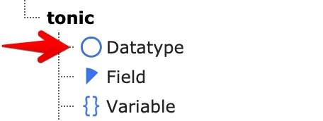
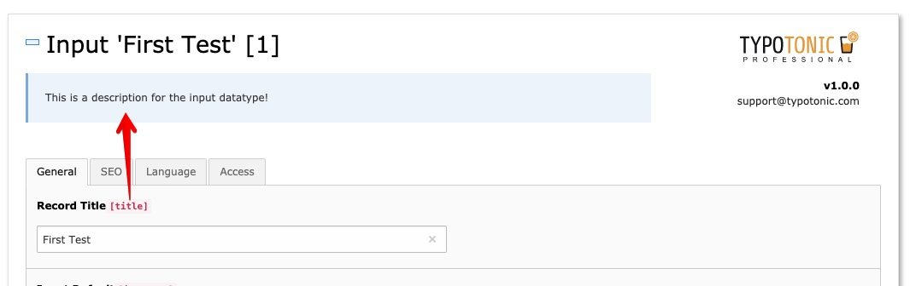

A Datatype describes one record type, for example "News" or "Event". It defines which fields the record uses and how it looks in the backend.

Open the **List** module, click **Create new record**, and select **Datatype**.
Create your fields first, or assign them to the Datatype later.

*Creating a new Datatype record*

## Tab: General

*General tab of a Datatype*

- **Name** — The name of the Datatype, for example Movie, News, Job, or Address.
- **Description** — A short text shown in the backend when editors create or edit records of this type.
- **Tablename** — The database table name, generated automatically. If the table does not exist yet, or needs to be updated, click **Update Table** to run the Schema Migrator.
- **According PHP Class** — The Domain Model and Repository generated for this Datatype. Click **Generate Class** or **Update Class** to create or refresh them.

## Tab: Fields

Assign the fields you created earlier to this Datatype.
The order you assign them in is the order they appear in the record edit form.

## Tab: Tab Configuration

- **Disable 'General' Tab** — Hides the default General tab. Any field not assigned to a custom tab is then hidden too.
- **Create tabs and assign fields** — Group fields into your own tabs. Palettes you configured on fields also appear inside the matching tab.

## Tab: Appearance

- **Icon** — The icon shown for this Datatype in the backend, and in the page tree when a page's behaviour uses this Datatype.
- **Color** — The background color shown while creating or editing a record of this type.
- **Hide Records of this type in list** — Hides records of this type from backend lists. Useful when this Datatype is only used as an inline element inside another record.
- **Hide Button to Add new Record** — Hides the toolbar button for creating a new record of this type on the selected page.

## Next Step

Continue with [Creating a Template Variable](/ExtTypoTonic/GettingStarted/CreatingATemplateVariable/Index) to add dynamic values to your templates, or skip ahead to [Templating](/ExtTypoTonic/GettingStarted/Templating/Index) to start rendering records in Fluid.
