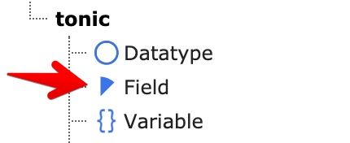
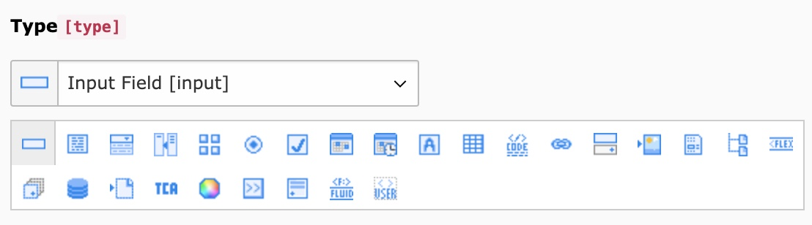
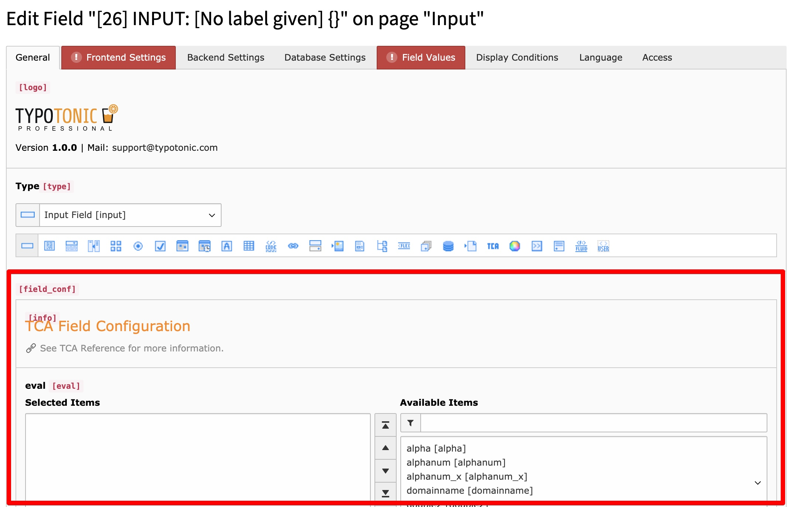

Fields are the building blocks of a Datatype. Create every field you need before you build the Datatype, or add them later.

Open the **List** module, click **Create new record**, and select **Field** under the **tonic** section.

*Creating a new Field record*

## Tab: General

- **Type** — The type of the field, for example text, number, or select. This determines which further options are available.
- **Field Configuration** — The configuration options for the chosen type. See the Field Types section of the official documentation for the options of each type.

*General field configuration*

## Tab: Frontend Settings

- **Frontend Label** — The label shown for the field. TypoTonic also converts this label into a variable name automatically. The generated variable name is shown below the label field.
- **Custom Variable Name** — A variable name of your own choice. Use this to override the automatically generated name. The variable is available in templates as `{record.yourvariable}`.
- **Frontend Type Definition** — The type used when TypoTonic maps the stored value for the frontend. This also controls how the value is generated in the domain model.
- **Is Object Storage** — Enable this when the field stores multiple values at once, for example an inline field. TypoTonic then puts the value into an Object Storage instead of a single value.

## Tab: Backend Settings

- **Use as record title** — Uses this field's value as the backend title of the record. If you select this on several fields, configure a **Title Divider Character** on the Datatype's **Appearance** tab to combine them.
- **Use value as path segment** — Uses this field's value to build the record's individual URL path segment.
- **Searchable in Backend** — Includes this field when editors use the backend search.
- **Exclude for non-admin users** — Hides the field from backend users unless they are an admin, or their user group has this field added as an allowed exclude field.
- **Exclude from translations** — Hides the field in translated versions of the record.
- **Palette** — Groups this field with other fields on the same palette, so they appear in the same row of the record edit form.
- **Backend Description** — A short help text shown next to the field in the record edit form.

## Tab: Database Settings

- **Database Type Definition** — The database column type. The default, **Inherit from Tca/Field Class**, generates a sensible column automatically. Only change this if you know exactly what you need.
- **Is Index Field** — Adds a database index for this field the next time the Schema Migrator updates the database structure.

## Tab: Field Values

Use this tab to define selectable values for the field, for example the options of a select box.

- **Static Value** — A fixed text value. You can use Fluid code inside the value.
- **Database Value** — A value fetched from the database with a query you configure.
- **TypoScript** — A value generated from TypoScript, for example:

      10 = TEXT
      10.value = My Option

- **Values of all records** — Returns all existing values already used for this field.

You can mark a value as **Is Default** to pre-select it, or as **Pretends to be an empty value** to create a select option with no stored value.

## Tab: Display Conditions

Use this tab to show or hide the field based on the value of another field.

- **Request update** — Reloads the form whenever this field's value changes. Use this when a select box should change which other fields are visible.
- **Display Conditions** — Written as `FIELD:2:IN:Selection 1,Selection2`, or using the FlexForm condition syntax.

## Next Step

Continue with [Creating a Datatype](/ExtTypoTonic/GettingStarted/CreatingADatatype/Index) to assign your fields to a Datatype.
