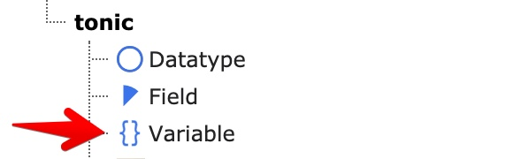
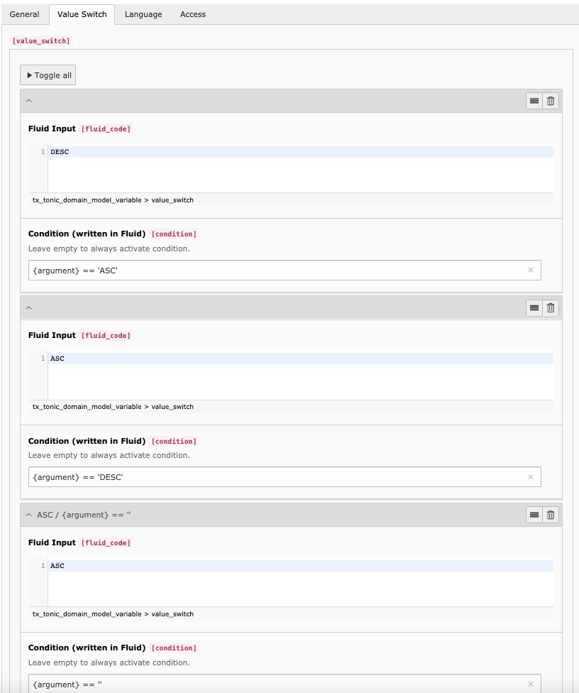

Template Variables inject dynamic values into TypoTonic Fluid templates. You select them in the Display Records plugin, and in other plugins.
Use them to build filters, search, sorting, or to change what a template shows based on the current request.

## Configuration

- **Name** — The variable name you will use in the Fluid template.
- **Type** — Determines where the value comes from. This can be a fixed value, or a dynamic one.

## Available Types

- **Fixed Value** — A fixed text value.
- **TypoScript Value** — A value parsed from TypoScript.
- **GET Variable** — A value from the page's GET parameters.
- **POST Variable** — A value from the page's POST parameters.
- **Database Value** — A value fetched from the database with a query you configure.
- **Frontend User** — The currently logged-in frontend user.
- **Server Variable** — A value from the PHP `$_SERVER` array.
- **User Session Variable** — A value from the frontend user's session.
- **Page** — The full page information of a selected page.
- **UserFunc** — The output of a PHP user function you enter.
- **Backend User** — The currently logged-in backend user, or `null` if none is logged in.
- **Language Id** — The current language ID.
- **TypoTonic Session Service Container** — All active filters, searches, and similar session data used by TypoTonic.

## Typical Use Cases

- Inject dynamic values, for example the current date.
- Inject the IDs of a back or list page, so links do not use hardcoded page IDs.
- Add custom PHP values using TypoScript and `USERFUNC`.
- Inject the current record into a page that uses several plugins.
- Show different content based on a condition.
- Combine variables with the Display Records plugin's filters.

## GET and POST Variables

GET and POST variables have extra options, because their value comes directly from the visitor's request.

- **Type Definition** — Restricts the variable to a specific data type, to prevent unwanted or malicious input.
- **Regular Expression** — Restricts the value further with a regular expression.
- **Allowed Values** — Limits the variable to a predefined list of values.
- **Value Switch** — Changes the variable's value with Fluid, based on a Fluid condition. Each switch has its own condition, and the first matching switch is applied.

*Example: a Value Switch that reverses a sort-order parameter*

## Next Step

Continue with [Templating](/ExtTypoTonic/GettingStarted/Templating/Index) to use variables and records inside your Fluid templates.
