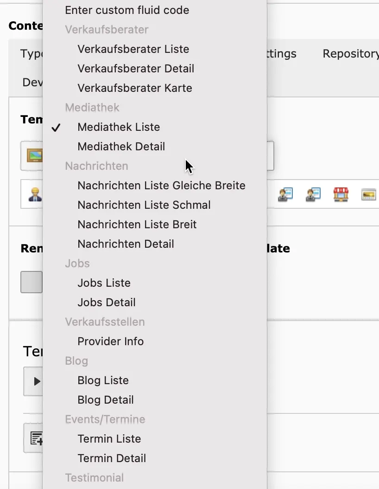

TonicTypes renders records with standard TYPO3 Fluid templates.

## Namespace

Core registers the Fluid namespace **`dv`** automatically (`K3n\Tonictypes\ViewHelpers`). You do not need to declare it manually.

For IDE autocompletion:

```html
<html
    lang="en"
    data-namespace-typo3-fluid="true"
    xmlns:f="http://typo3.org/ns/TYPO3/CMS/Fluid/ViewHelpers"
    xmlns:dv="http://typo3.org/ns/K3n/Tonictypes/ViewHelpers">
</html>
```

## Available Variables

- **Records** — List plugins inject `{records}` by default (name configurable via `plugin.tx_tonictypes` settings / Site Settings).
- **Record** — Single-record context uses `{record}` by default.
- **Field value** — `{record.fieldname}`. Type follows the field **Frontend Type Definition**.

Use `<f:debug>{record.fieldname}</f:debug>` or `<f:debug>{_all}</f:debug>` while developing.

## Predefining Templates in TypoScript

```typoscript
plugin.tx_tonictypes.templates {
    myTemplateIdentifier {
      group = General
      icon = EXT:tonictypes/Resources/Public/Icons/Datatype/animal-dog.png
      name = My Test Template
      file = EXT:yourtemplateext/Resources/Private/Templates/Tonictypes/TemplateOne.html
    }
}
```



*Predefined template in the selector*

```html
<dv:template.render template="myTemplateIdentifier" arguments="{record:record}" />
```

See [ViewHelpers](/en/latest/ExtTypoTonic/ViewHelpers/Index).

## Next Step

Continue with [Frontend Plugins](/en/latest/ExtTypoTonic/FrontendPlugins/Index).
