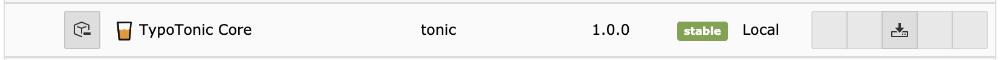
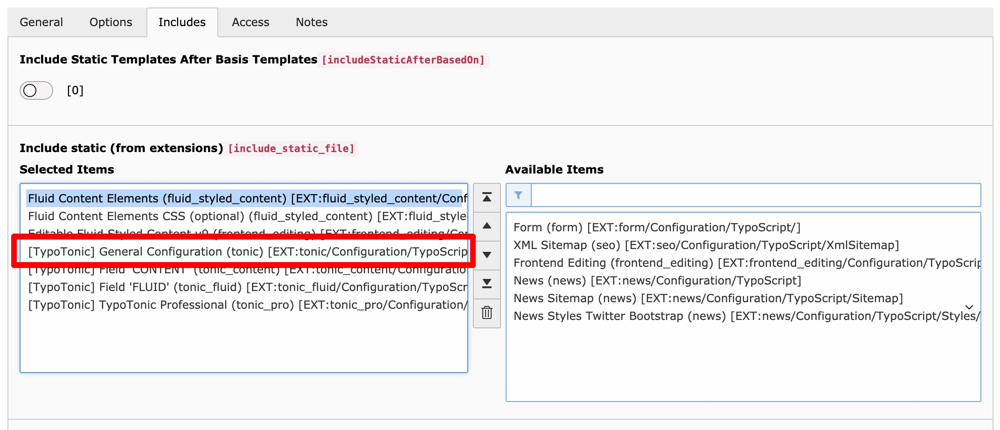
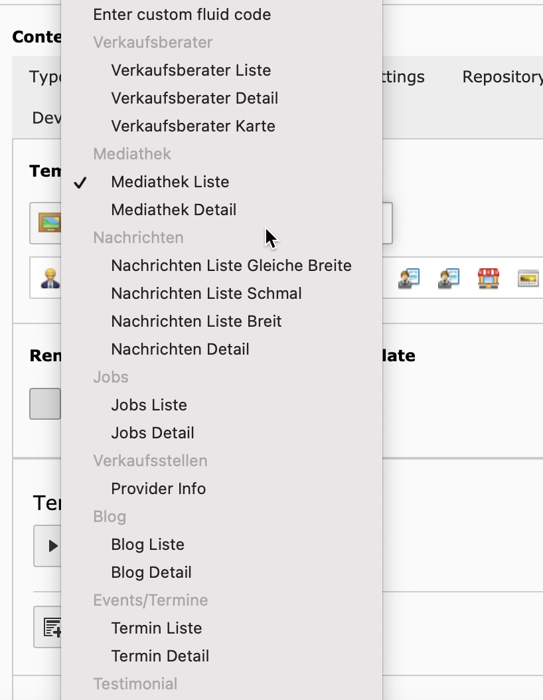
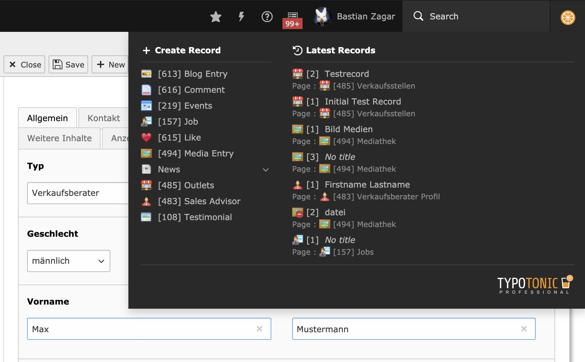
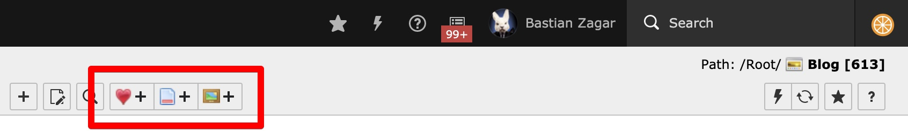

<Note>
The technical documentation for this extension uses the Composer package `aix/tonic` and the extension key `tonic`. The vendor is also rebranding the product as **TONICTYPES**, and its marketing pages reference a newer package name, `k3n/tonictypes`. Before you install, check the [TER extension page](https://extensions.typo3.org/extension/tonic) to confirm which package name and TYPO3 version range are current for your project.
</Note>

## Step 1 - Install the Extension

Install the extension with Composer, or upload it manually with the Extension Manager.

::

    composer require aix/tonic

Once the extension is installed and the version matches your TYPO3 installation, it appears in your extension list.



*The extension in the TYPO3 Extension Manager after installation*

## Step 2 - Include the Static Template

TypoTonic needs its static template included in your site template.
This adds the fields and configuration TypoTonic needs to work.

1. Open the **Template** module for your site's root page.
1. Select **Info/Modify**, then **Edit the whole template record**.
1. Switch to the **Includes** tab.
1. Under **Include static (from extensions)**, add **[TypoTonic] General Configuration (tonic)**.



*Adding the TypoTonic static template under Includes*

## Step 3 - Clear the Caches

Clear all TYPO3 caches so your new TypoScript configuration is loaded.

## Additional Configuration

### Predefine Templates in TypoScript

You can predefine templates for the template selector in TypoScript instead of choosing a file manually every time.
Add this to your root page TypoScript:

```typoscript
plugin.tx_tonic.templates {
    myTemplateIdentifier {
      group = General
      icon = EXT:tonic/Resources/Public/Icons/Datatype/brick.png
      name = My Test Template
      file = EXT:tonic_templates/Resources/Private/Templates/tonic_test1.html
    }
}
```



*A predefined template appearing in the template selector*

Once a template is predefined this way, you can render it in Fluid with the `Template.RenderViewHelper`. See [ViewHelpers](/ExtTypoTonic/ViewHelpers/Index) for the full syntax.

### Toolbar Item (Professional Feature)

TypoTonic Professional adds a toolbar item for fast access to create and edit records.



*The Professional toolbar item*

To turn the toolbar item off, add this to the User TSconfig:

```typoscript
options {
    tonic {
       disableTonicToolbarItem = 1
    }
}
```

### Frontend Record Editing (Professional Feature)

TypoTonic Professional can also show an edit button on the frontend detail page, so logged-in backend users can jump straight to editing a record.


*The frontend edit button, shown in the top-right corner of the page*

Enable it with this User TSconfig:

```typoscript
options {
    tonic {
       enableRecordEditButton = 1
    }
}
```

### Add Record Creation Buttons to the DocHeader

You can add "create new record" buttons for specific Datatypes to the list module's DocHeader.
Add the Datatype UIDs to the Page TSconfig:

```typoscript
tx_tonic {
   docHeaderDatatypes = 1,2,3
}
```



*DocHeader buttons for creating new Datatype records*

<Note>
This button is also added automatically when you configure the page's **Behaviour** setting with a Datatype.
</Note>

## Next Steps

Continue with [Getting Started](/ExtTypoTonic/GettingStarted/Index) to create your first field, Datatype, and record.
