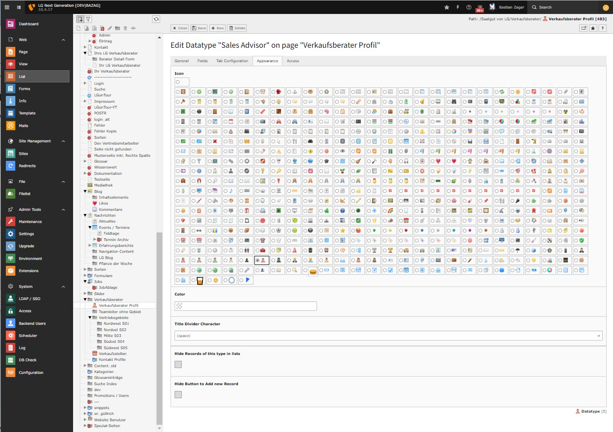
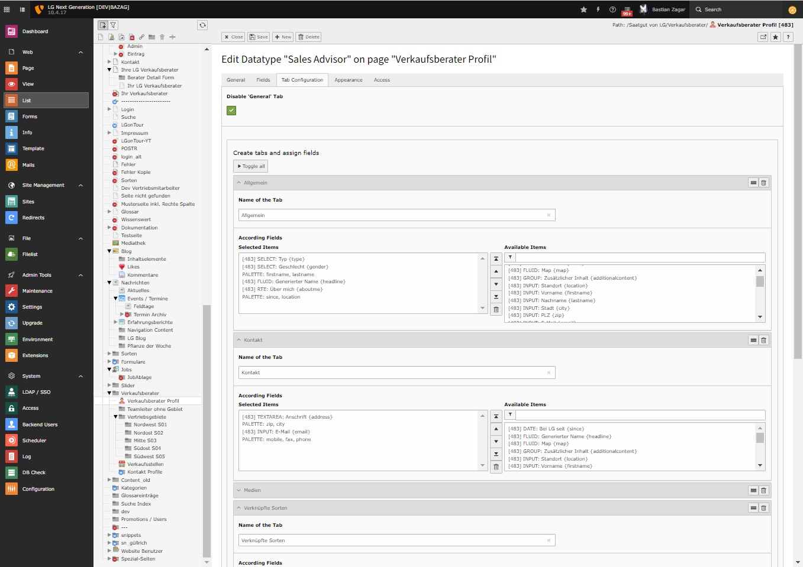
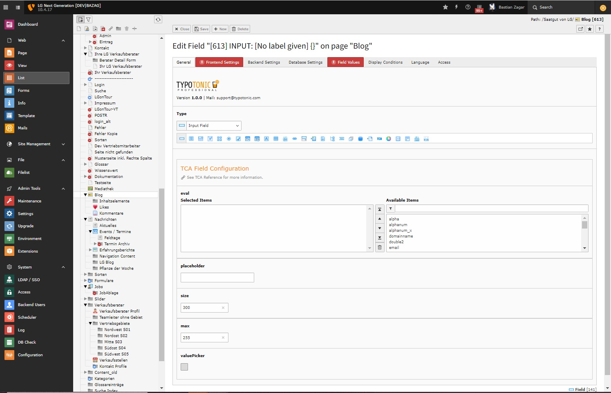
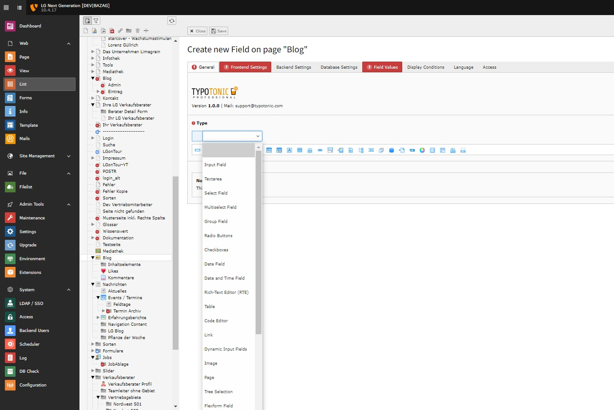
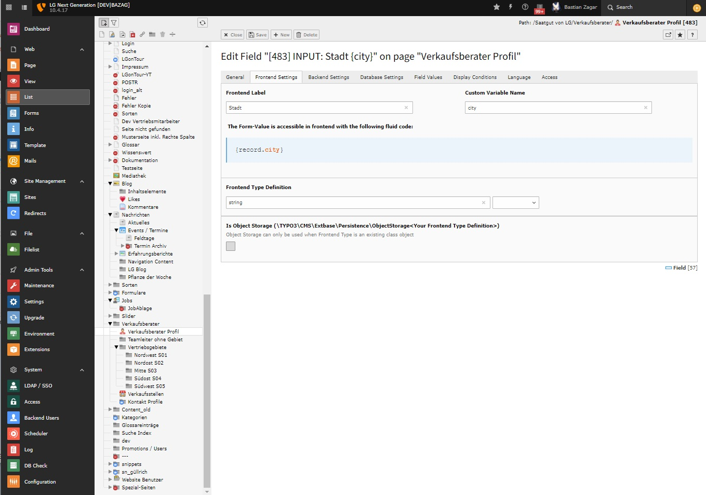
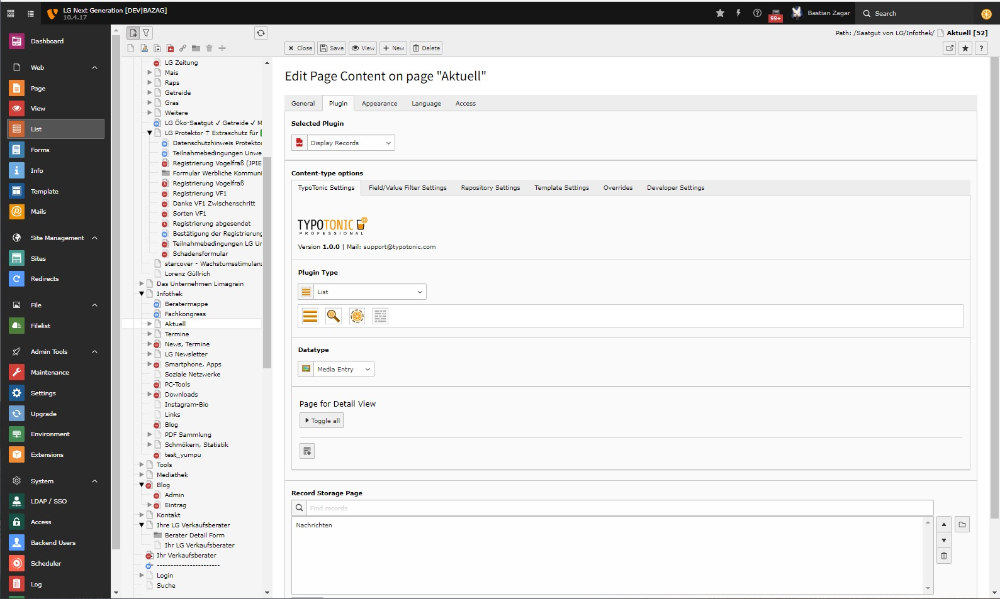
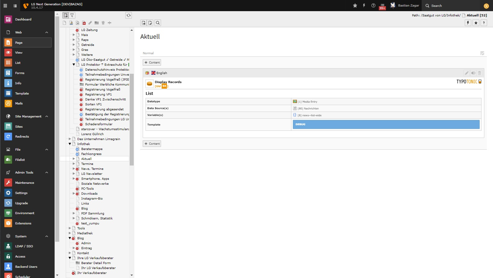
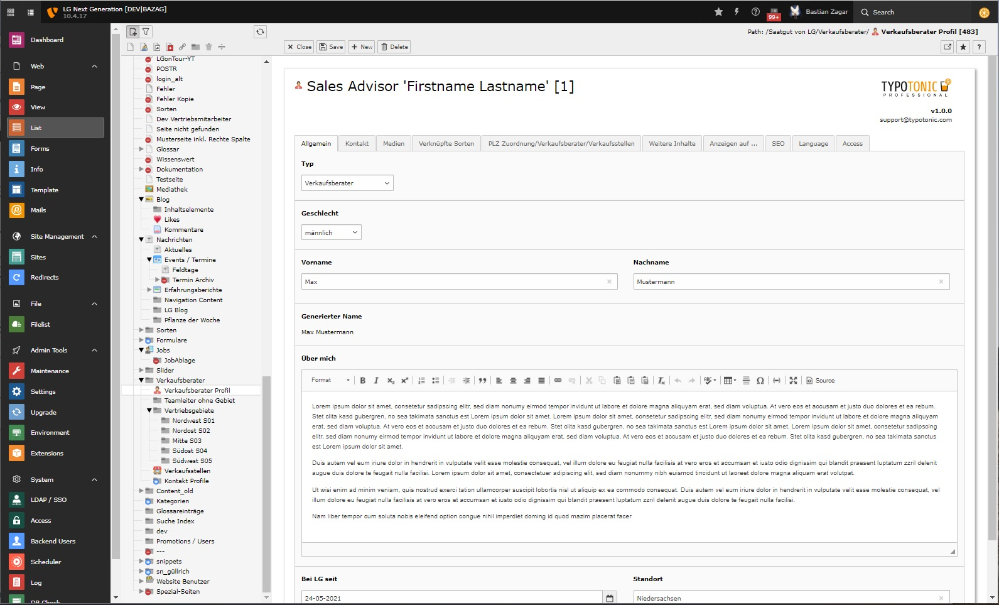
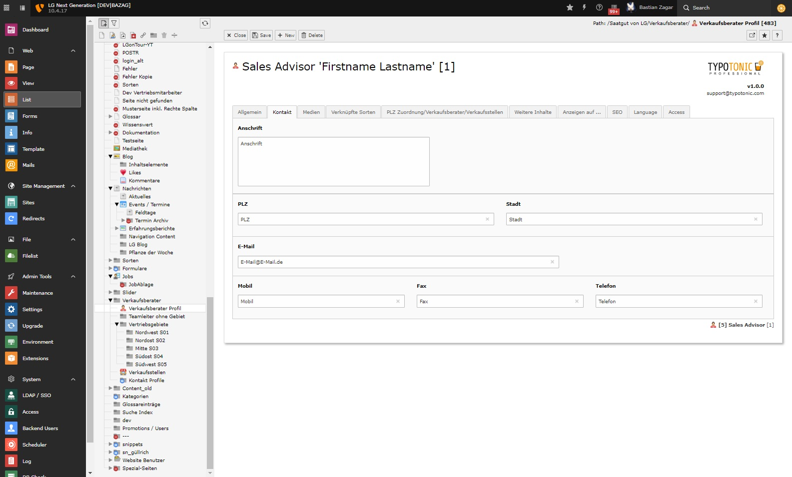
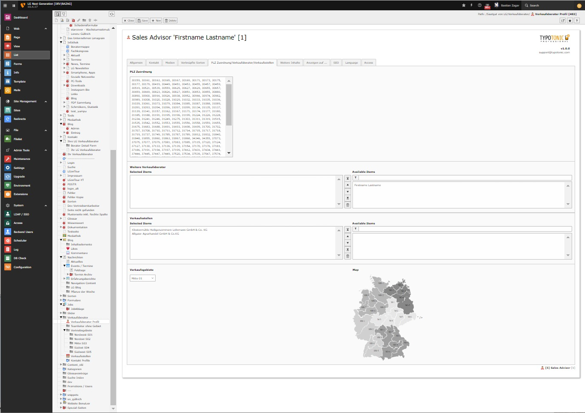

TypoTonic can build almost any kind of record. These screenshots show a few examples of what is possible.

## Creating Datatypes

*General tab*

*Appearance tab*

*Tab Configuration tab*

## Field Configuration

*Field configuration*

*Field selection*

*Frontend Settings tab*

## Display Records Plugin

*Plugin configuration*

*Frontend preview*

## Editing Records

*Editing a record*

*Editing a record*

*Editing a record*
