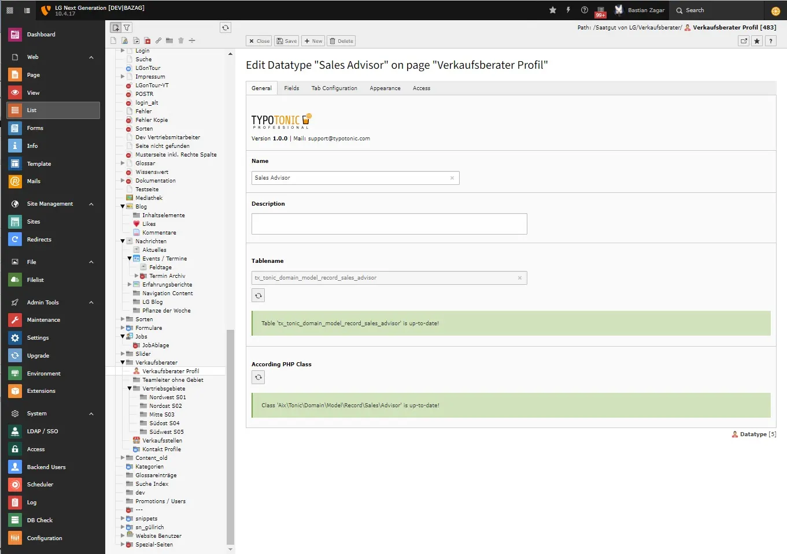
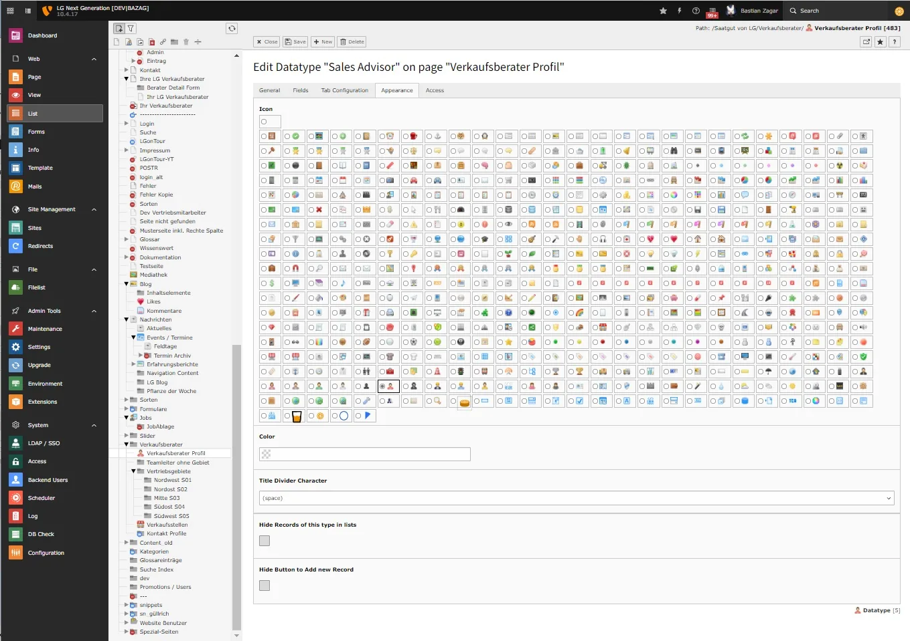
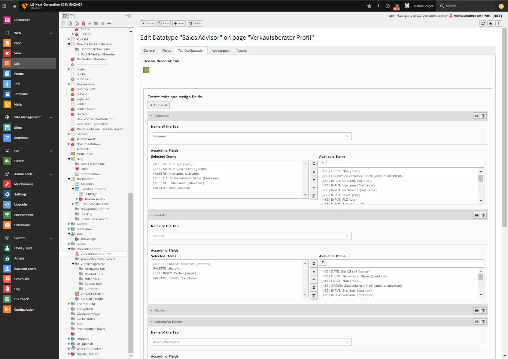
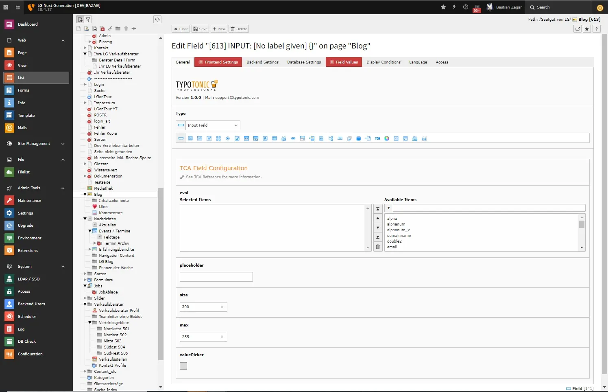
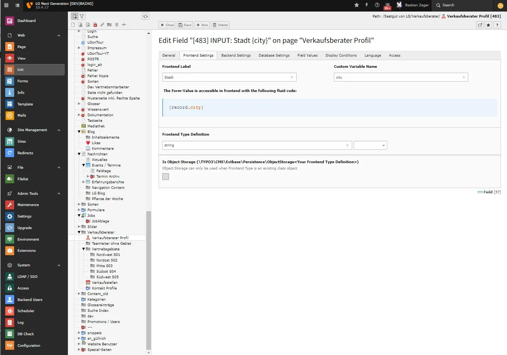
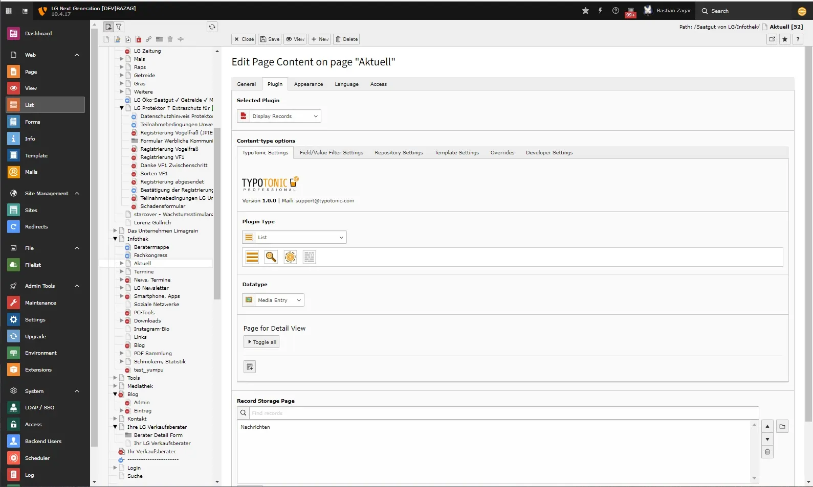
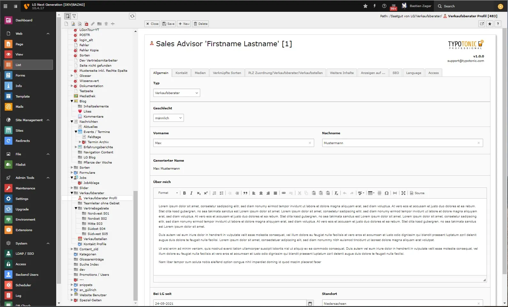
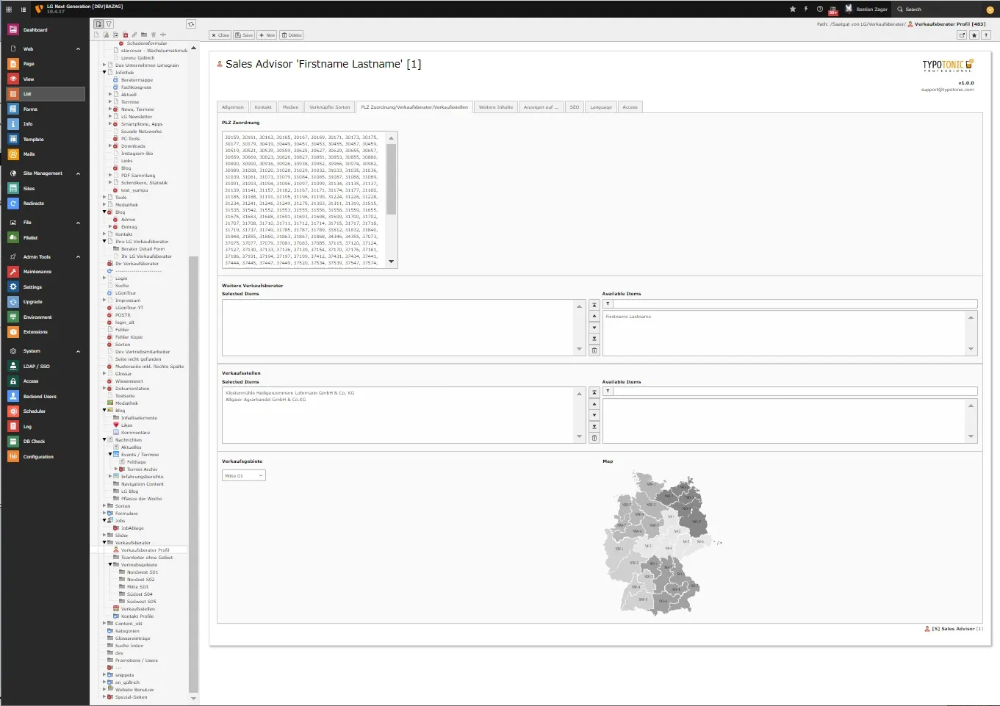

These screenshots illustrate typical TonicTypes (Core) workflows. UI branding may show older TypoTonic labels in places; behaviour matches current `tonictypes` / `tonictypes_pro`.

## Creating Datatypes

*General tab*

*Appearance tab*

*Tab Configuration tab*

## Field Configuration

*Field configuration*

*Field selection*

*Frontend Settings tab*

## Frontend plugins

*Plugin configuration (List / Detail / Dynamic / Plain)*

*Frontend preview*

## Editing Records

*Editing a record*

*Editing a record*

*Editing a record*
