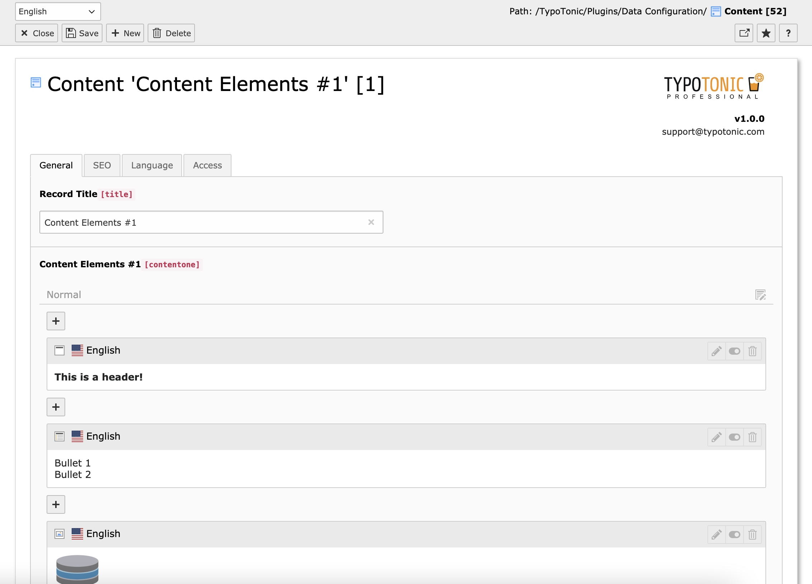
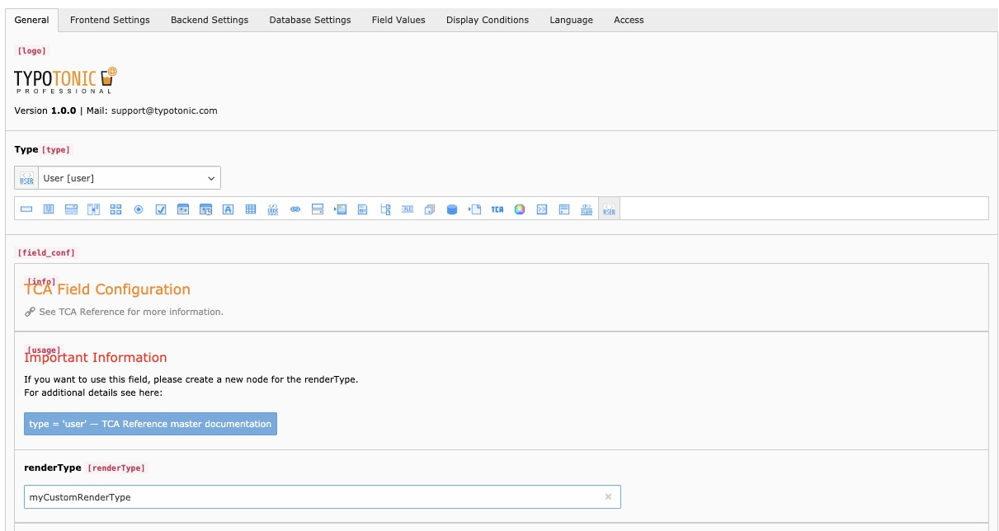

TypoTonic Professional is a separate, paid extension that adds extra tools for working with your data structures. It is sold and supported directly by the vendor, keeen GmbH, at [www.typotonic.com](https://www.typotonic.com). T3Planet does not sell or license this add-on.

## What It Adds

- A backend **toolbar item** for fast access to creating and editing records. See **typotonic-toolbar-item**.
- A **frontend record edit button**, shown on a record's dynamic detail page, for quick access to edit that record. See **typotonic-frontend-edit-button**.
- The option to set a custom logo and a custom support email for your customers.
- Additional frontend plugins for filtering, sorting, pagination, and searching records.

## TypoTonic Components

### Component 'API'

Build a custom REST API by configuring an endpoint, without writing PHP. It currently supports GET requests, and the vendor plans to extend it further.

## TypoTonic Fields

### Field 'Content'

Adds a page-module-like field to your Datatype. This lets you add TYPO3 content elements inside a record, similar to how you add them to a page. It works well for content-heavy records, such as blog articles.

*The Content field, showing content elements inside a record*

### Field 'Fluid'

Combines all of a record's information into a single generated field. TypoTonic generates the content when the record is saved, and stores it for use in filters, search, custom record titles, and other places.

*The Fluid field*

### Field 'User'

Runs a custom PHP user function and stores its result in the field. You can pass your own parameters to the function through the field configuration.

*The User field*

<Note>
TypoTonic Professional features and pricing are managed entirely by the vendor. For details, visit [www.typotonic.com](https://www.typotonic.com) or see the [FAQ](/ExtTypoTonic/FAQ/Index).
</Note>
