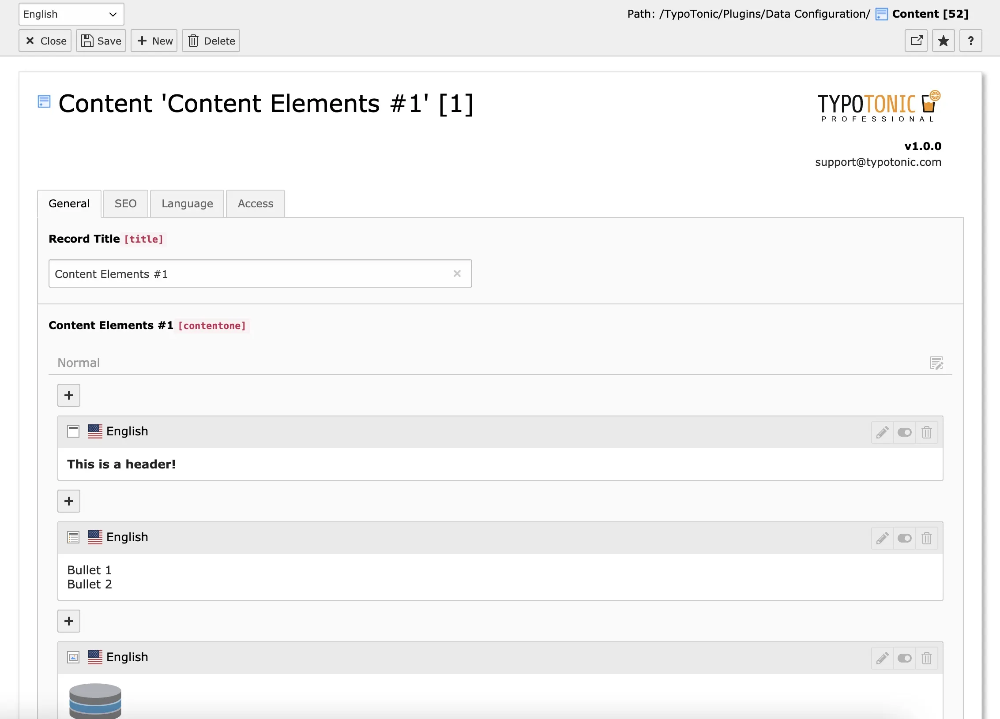
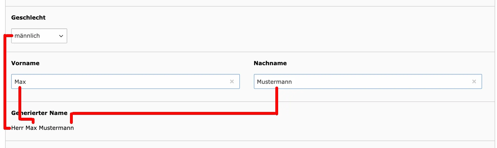
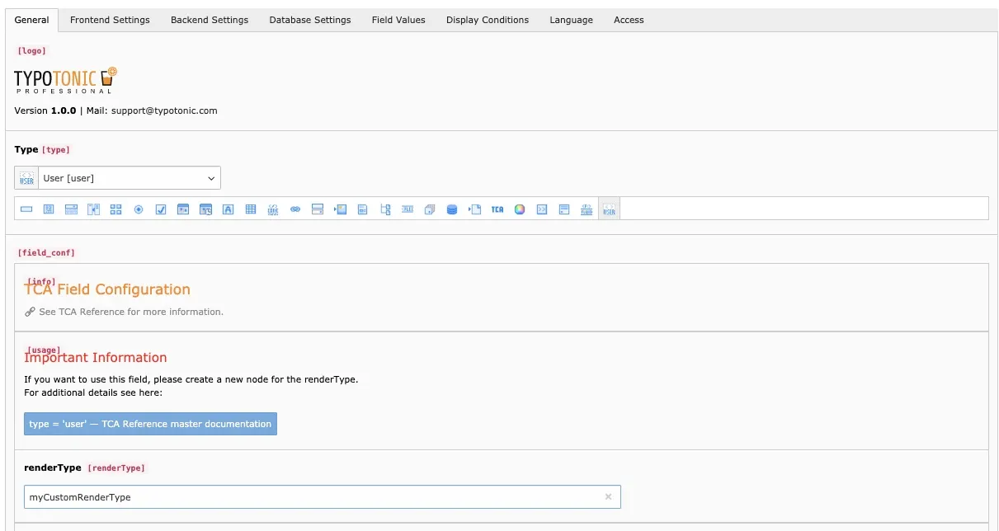

TonicTypes Professional (`k3n/tonictypes_pro`, extension key `tonictypes_pro`) extends [TonicTypes Core](/en/latest/ExtTypoTonic/Introduction/Index) with enterprise features. It is developed by Keeen GmbH and distributed for T3Planet projects with license activation via `ns_license`. T3Planet does not replace vendor support for the product itself.

**Requires:** `k3n/tonictypes` 2.x · `nitsan/ns-license` · `nitsan/ns-t3af` · PHP 8.2–8.5 · TYPO3 12.4–14.9

Product site: [https://www.tonictypes.com](https://www.tonictypes.com)

## Install and activate

```bash
composer require k3n/tonictypes
composer require k3n/tonictypes_pro
```

Site Sets:

```yaml
dependencies:
  - k3n/tonictypes
  - k3n/tonictypes_pro
```

Or include static templates **[Tonictypes] General Configuration** and **[Tonictypes] Tonictypes Professional**, then clear caches.

See [Installation](/en/latest/ExtTypoTonic/Installation/Index).

## What Professional adds

- Backend **toolbar item** for recent records and quick create
- **DocHeader** “Add record” buttons for selected datatype UIDs
- **Advanced field types** (see below)
- **MCP tools** (via AI Foundation / `ns_t3af`) for datatype, field, and record management
- **Link handler** for TonicTypes records in the TYPO3 link browser
- Enhanced **routing** support (`Tonictypes` enhancer / `TonictypesMapper` aspect; Core also registers enhancers — Professional Xclasses `PageRouter` for fuller access)
- **Form** extension hooks to prefill form fields in a TonicTypes record context
- Removes “Buy Professional” messages when licensed
- Branding User TSconfig (custom logo / support email)

Datatype **export/import** lives in **Core** from 2.1.0 (`System > Export / Import`) — not Professional-only.

Separate filter / sort / pagination / search **plugins** are on the vendor roadmap; Core List plugins already support FlexForm filters and sorting.

## Backend toolbar

Professional registers a toolbar item for managing latest records and creating new ones.

Disable:

```typoscript
options.tonictypes.disableTonictypesToolbarItem = 1
```

Related options: `customSupportEmail`, `customLogo`, `customLogoBright`, `disableSupportMessage`, `disableTonictypesLogo`.

## DocHeader buttons

Page TSconfig:

```typoscript
tx_tonictypes.docHeaderDatatypes = 1,2,3
```

Or select a datatype behaviour on the page. See [Installation](/en/latest/ExtTypoTonic/Installation/Index).

## Link handler

Professional registers a link handler so editors can link to TonicTypes records from the link browser (`TCEMAIN.linkHandler.tonictypes`). Loaded via the Professional Site Set / Page TSconfig.

## Advanced field types (Professional)

These types are declared in Professional TypoScript (`plugin.tx_tonictypes.fieldtypes`) and are **not** available in Core alone:

| Type key | Class purpose |
| --- | --- |
| `user` | UserFunc field — run custom PHP as a FormEngine field |
| `content` | Inline TYPO3 content elements inside a record |
| `fluid` | Generate/store Fluid-rendered HTML for titles, filters, search |
| `flex` | FlexForm-based field |
| `inline` | Inline related records |
| `datatype` | Relation to another Datatype |
| `dyninput` | DynamicInput — FlexForm-driven dynamic inputs |
| `passthrough` | PassThrough TCA field |
| `tca` | Raw / custom TCA configuration field |

### Content

Page-module-like content elements inside a record (for example blog-like bodies).



### Fluid

Combines record data into a generated field when the record is saved.



### User (UserFunc)

Runs a custom PHP user function and stores the result. Pass parameters through the field configuration.



Use UserFunc fields only with trusted PHP. Avoid exposing arbitrary code execution to untrusted editors.

## MCP tools (Professional + AI Foundation)

Professional registers MCP tools through `ns_t3af` (`NITSAN\NsT3AF\Contract\McpToolsExtensionCardProviderInterface`). Tools operate on datatypes, fields, and records:

**Datatypes:** `tonictypes_datatype_list`, `tonictypes_datatype_get`, `tonictypes_datatype_create`, `tonictypes_datatype_update`, `tonictypes_datatype_delete`, `tonictypes_datatype_publish`

**Fields:** `tonictypes_field_list`, `tonictypes_field_get`, `tonictypes_field_create`, `tonictypes_field_update`, `tonictypes_field_delete`

**Records:** `tonictypes_record_list`, `tonictypes_record_get`, `tonictypes_record_create`, `tonictypes_record_update`, `tonictypes_record_delete`

`tonictypes_datatype_publish` migrates the record table, generates TCA and model/repository classes, and clears caches. MCP create/update for records accepts field values as JSON (`dataJson`); some relation/file/content fields may need companion file/reference tools.

Requires a working AI Foundation (`ns_t3af`) MCP setup and a valid license where applicable.

## Upgrade notes (Professional 2.1.0)

- PHP 8.2+
- Pair with Core 2.1.0+ (transfer module moved to Core)
- Clear all caches after upgrade

## Vendor links

- Shop / product: [https://www.tonictypes.com](https://www.tonictypes.com)
- Free Core on TER: [https://extensions.typo3.org/extension/tonictypes](https://extensions.typo3.org/extension/tonictypes)
- Support email: support@tonictypes.com
