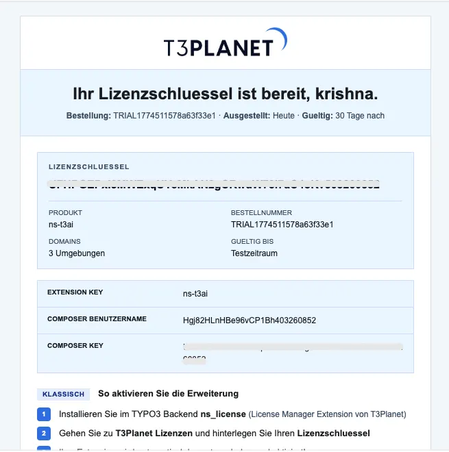

The `ns_license` extension is the TYPO3 T3Planet Shop that helps you request, activate, monitor, extend, and renew extension licenses in one place.

Previously, getting a trial or buying a license needed a few manual steps outside TYPO3. Now you can start a free trial or purchase an extension right from the TYPO3 backend using **T3Planet Shop**. Details are here: [Generating a License Key](/en/latest/License/GenerateLicenseKey/Index).

This documentation covers:

- Generating or requesting a user license key
- Activating and managing licenses in T3Planet Shop
- Reviewing all licenses in the **All Licenses** tab
- Extending trial licenses
- Renewing or purchasing licenses after trial
- Exploring other T3Planet products and services

The **Website Builder** tab in T3Planet Shop is a link to T3Planet's TYPO3 SaaS offer ([https://t3planet.de/en/typo3-saas](https://t3planet.de/en/typo3-saas)). It is not a separate licensing feature.

**Where to find the module:** in TYPO3 v14 open **System → T3Planet Shop**; in v12 and v13 it is under **Admin Tools → T3Planet Shop**. T3Planet Shop is the module previously called License Manager.

If you are a premium customer and cannot find your license email, submit a support request: [https://t3planet.de/support](https://t3planet.de/support)

## Sample license email

