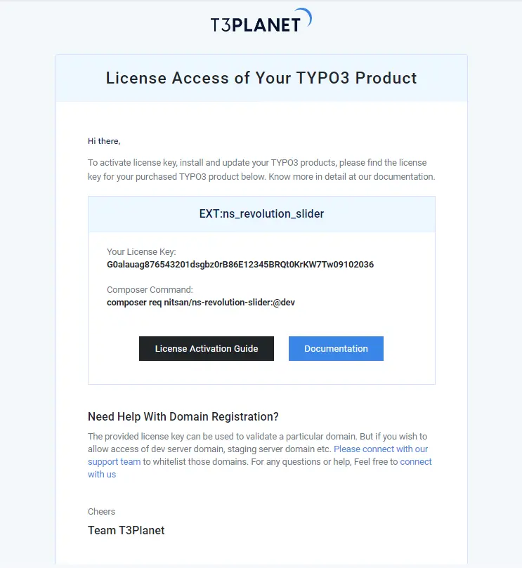

## About This Documentation

- T3Planet’s all premium TYPO3 products (extensions and templates) are secured with License-key validation.
- If you are a premium customer of T3Planet, please follow this guideline to activate the license key and install your premium TYPO3 extension.

## How to Get License Key?

- Whenever you buy a premium TYPO3 product, you will get an email with the subject line “[T3Planet] License Access of Your TYPO3 Product(s)”.
- In that email, you will get a license key for each purchased product.
- In case, if you did not such “license email”, please submit support ticket and our executive will get back to you asap [https://t3planet.de/support](https://t3planet.de/support)

## Sample License Email

