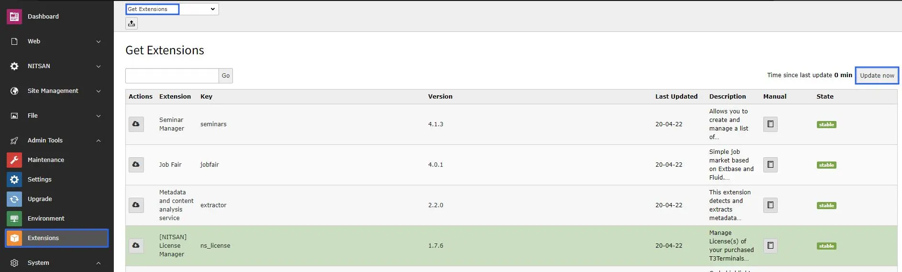
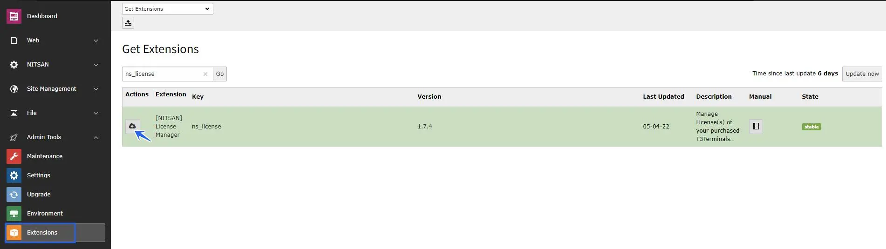
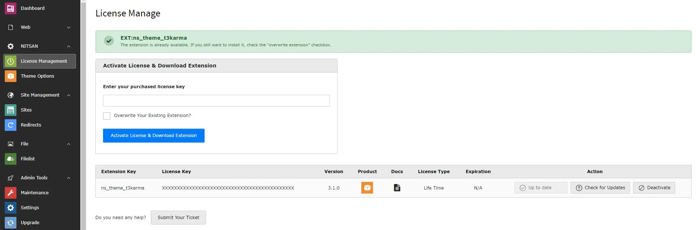
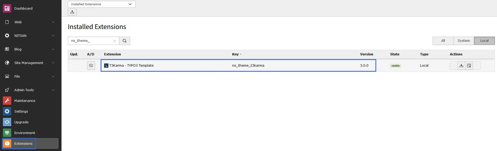

## Install via Extension Manager

**Step 1.** Go to Extension module & Select “Get extensions” from the drop-down at top. Click on the Update Now button to get the Extension Repository.



**Step 2.** Now, Download the ns_license extension & install it.



**Step 3.** Switch to NITSAN > License Management > Add Your License Key.




**Step 4.** Go to Admin Tools > Extensions > Activate Your Purchased Extension.



## Install via Composer

**Step 1.** Install EXT:ns_license

```python
composer require nitsan/ns-license

vendor/bin/typo3 extension:setup
```

**Step 2.** Go to TYPO3 Backend > License Manager > Add Your License Key.


**Step 4.** Run Composer Command

<Note>
We have already sent the license key & composer credentials (like username, license key) via Email. If you need any help, then write to our support team [https://t3planet.de/support](https://t3planet.de/support)
</Note>

```python
composer config repositories.t3planet '{
   "type": "composer",
   "url": "https://composer.t3planet.cloud",
   "only": ["nitsan/<PACKAGE-NAME>"]
}'
```

**Example:**

If installing the extension **ns_t3ai** package, use the following command:

```python
composer config repositories.nitsan '{
   "type": "composer",
   "url": "https://composer.t3planet.cloud",
   "only": ["nitsan/ns-t3ai"]
}'
```

<Note>
If you don’t know the exact ``<PACKAGE-NAME>``, check the **composer.json** file in the repository. The package name can be found in the first line as shown below:
</Note>

```json
"name": "nitsan/ns-t3ai"
```

```python
composer config http-basic.composer.t3planet.cloud <USERNAME> <LICENSE-KEY>
```

```python
composer req nitsan/<PACKAGE-NAME> --with-all-dependencies
```

```python
vendor/bin/typo3 extension:setup
```

<Warning>
If you are installing EXT:ns_revolution_slider with TYPO3 >= v11 composer-based TYPO3 instance, Please don’t forget to run the below commands.
</Warning>

```python
vendor/bin/typo3 nsrevolution:setup
```

## Multiple Extensions Installation via Composer

If you want to install multiple premium TYPO3 extensions in your single TYPO3 instance, you can use our multiple dedicated Composer servers which support up to 99 extensions. Follow the steps below:

```python
composer config repositories.t3planet1 '{
   "type": "composer",
   "url": "https://composer1.t3planet.cloud",
   "only": ["nitsan/<PACKAGE-NAME>"]
}'
```

```python
composer config http-basic.composer1.t3planet.cloud <USERNAME> <LICENSE-KEY>
```

```python
composer req nitsan/<PACKAGE-NAME> --with-all-dependencies
```

```python
vendor/bin/typo3 extension:setup
```

### Adding More Extensions (Up to 99)

To add more extensions, you can repeat the same steps with the following changes:

- Update the repository name to: **repositories.t3planet(n)** — where **n** ranges from 1 to 99
- Update the repository URL to: **https://composer(n).t3planet.cloud** — where `n` ranges from 1 to 99
- Update the credentials **composer config http-basic.composer(n).t3planet.cloud `<USERNAME>` `<LICENSE-KEY>`**
— where **n** ranges from 1 to 99

## License Migration from Free Trial to Premium

To migrate from a **Free Trial** license to a **Premium** license, follow the steps below:

**Step 1:** Go to the **License Manager** module.

**Step 2:** Deactivate and delete the existing license key (Free Trial license key).

**Step 3:** Enter the new **Premium license key** (received via email).

**Step 4:** Navigate to the **Extension Manager**, activate the extension, and start using it.

For more detailed instructions on license activation and installation, please refer to the official documentation:

[https://docs.t3planet.de/en/latest/License/Index.html](/License/Index)

## Interactive demos

<div className="t3-embed"><iframe src="https://app.supademo.com/showcase/cmmyt7j5c0075wy0imx44tkvn?demo=1&step=1&utm_source=embed" loading="lazy" title="Register and Manage Domains in TYPO3" allow="clipboard-write" frameBorder="0" webkitallowfullscreen="true" mozallowfullscreen="true" allowfullscreen></iframe></div>

