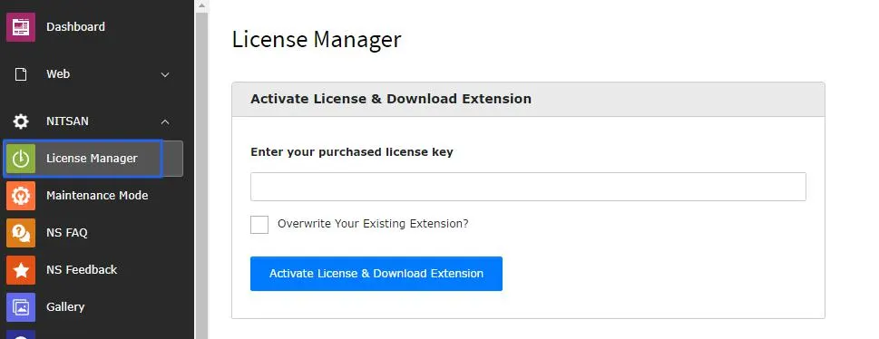

Install **T3Planet Shop** (`ns_license`), then start a free trial, purchase a license, or add an existing key from the TYPO3 backend.

For trial and purchase from the backend, see [Generating a License Key](/en/latest/License/GenerateLicenseKey/Index).

<Note>
  **Where to find the module:** in TYPO3 v14 open **System → T3Planet Shop**. In TYPO3 v12 and v13 it is under **Admin Tools → T3Planet Shop**. T3Planet Shop is the module previously called License Manager.
</Note>

## Install via Extension Manager

Get **T3Planet Shop** (`ns_license`) from the TYPO3 Extension Repository (TER): [https://extensions.typo3.org/extension/ns_license](https://extensions.typo3.org/extension/ns_license)

**Step 1.** Go to the Extension module and select "Get extensions" from the drop-down at the top. Click the Update Now button to refresh the Extension Repository.


**Step 2.** Search for `ns_license` (T3Planet Shop), then download and install it from TER.


**Step 3.** Open **T3Planet Shop**. Start a free trial, purchase, or add your license key.




**Step 4.** Go to Admin Tools > Extensions > Activate Your Purchased Extension (if not already activated via T3Planet Shop).


## Create and Get your License Key (Interactive Demo)

You can also create a license key from the website, then activate it in T3Planet Shop.
For the backend flow, see [Generating a License Key](/en/latest/License/GenerateLicenseKey/Index).

<div className="t3-embed"><iframe src="https://app.supademo.com/showcase/cmmyt7j5c0075wy0imx44tkvn?demo=1&step=1" loading="lazy" title="Create and Get your License Key" allow="clipboard-write; fullscreen" frameBorder="0" webkitallowfullscreen="true" mozallowfullscreen="true" allowfullscreen></iframe></div>

**Step 1.** Click `Get Started` on the demo page.

**Step 2.** Open the `Products` menu to explore available solutions.

**Step 3.** Select the `News Comment` extension.

**Step 4.** Click `Start Free Trial` to start the trial.

**Step 5.** Scroll down and click `Start Free Trial` once more.

**Step 6.** Review and accept the Privacy Policy and Terms to proceed.

- Fill `Name *`, `Email *`, and `Telephone (Optional)`.
- Tick the agreement checkbox.

**Step 7.** Click `Continue`.

**Step 8.** Enter your 3 environment domains:

- `Local Domain *`
- `Staging Domain`
- `Production Domain`

One license key covers your local, staging and production environments. Only production domains count towards your license tier.

**Step 9.** Click `Send verification code`.

**Step 10.** Enter the `Verification code` and click `Confirm & get my license key`.

- If you cannot find it, check your spam/junk folder (and use `Resend code` when available).

**Step 11.** Close the window and continue.

After you receive your license key, you can activate the extension in TYPO3:

**Step 12.** Open **T3Planet Shop** and paste your key into the `License Key` field.

**Step 13.** Click `Activate License & Download Extension` and then activate the purchased extension in Admin Tools > Extensions.

## Install via Composer

**Step 1.** Install EXT:ns_license (T3Planet Shop)

```bash
composer require nitsan/ns-license

vendor/bin/typo3 extension:setup
```

**Step 2.** Open **T3Planet Shop** in the TYPO3 backend. Start a free trial, purchase, browse products, or add your license key.


**Step 3.** Run the Composer commands

<Note>
We have already sent the license key & composer credentials (like username, license key) via Email. If you need any help, then write to our support team [https://t3planet.de/support](https://t3planet.de/support)
</Note>

```bash
composer config repositories.t3planet '{
   "type": "composer",
   "url": "https://composer.t3planet.cloud",
   "only": ["nitsan/<PACKAGE-NAME>"]
}'
```

**Example:**

If installing the extension **ns_t3ai** package, use the following command:

```bash
composer config repositories.t3planet '{
   "type": "composer",
   "url": "https://composer.t3planet.cloud",
   "only": ["nitsan/ns-t3ai"]
}'
```

<Note>
If you don’t know the exact ``<PACKAGE-NAME>``, check the **composer.json** file in the repository. The package name can be found in the first line as shown below:
</Note>

```json
"name": "nitsan/ns-t3ai"
```

```bash
composer config http-basic.composer.t3planet.cloud <USERNAME> <LICENSE-KEY>
```

```bash
composer req nitsan/<PACKAGE-NAME> --with-all-dependencies
```

```bash
vendor/bin/typo3 extension:setup
```

<Warning>
If you are installing EXT:ns_revolution_slider in a Composer-based TYPO3 instance (v11 or newer), also run the command below.
</Warning>

```bash
vendor/bin/typo3 nsrevolution:setup
```

## Multiple Extensions Installation via Composer

If you want to install multiple premium TYPO3 extensions in your single TYPO3 instance, you can use our multiple dedicated Composer servers which support up to 99 extensions. Follow the steps below:

```bash
composer config repositories.t3planet1 '{
   "type": "composer",
   "url": "https://composer1.t3planet.cloud",
   "only": ["nitsan/<PACKAGE-NAME>"]
}'
```

```bash
composer config http-basic.composer1.t3planet.cloud <USERNAME> <LICENSE-KEY>
```

```bash
composer req nitsan/<PACKAGE-NAME> --with-all-dependencies
```

```bash
vendor/bin/typo3 extension:setup
```

### Adding More Extensions (Up to 99)

To add more extensions, you can repeat the same steps with the following changes:

- Update the repository name to: **repositories.t3planet(n)** — where **n** ranges from 1 to 99
- Update the repository URL to: **https://composer(n).t3planet.cloud** — where `n` ranges from 1 to 99
- Update the credentials **composer config http-basic.composer(n).t3planet.cloud `<USERNAME>` `<LICENSE-KEY>`** — where **n** ranges from 1 to 99

## License Migration from Free Trial to Premium

To migrate from a **Free Trial** license to a **Premium** license, follow the steps below:

**Step 1:** Open the **T3Planet Shop** module.

**Step 2:** Click **Buy Now** on the trial card, or deactivate and delete the existing Free Trial license key.

**Step 3:** Enter the new **Premium license key** (received via email), if not already applied via backend purchase.

**Step 4:** Activate the extension from T3Planet Shop / Extension Manager and start using it.

For more detailed instructions on license activation and installation, please refer to the [License documentation](/en/latest/License/Index).
