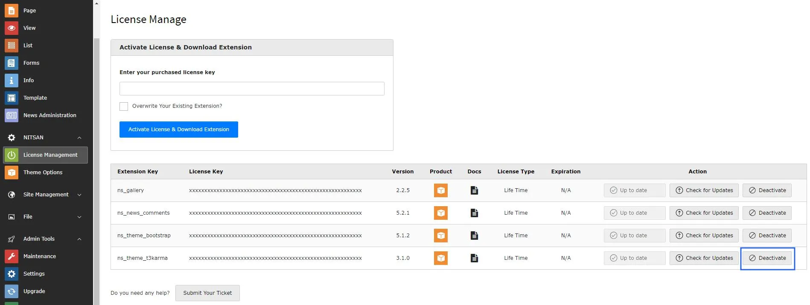
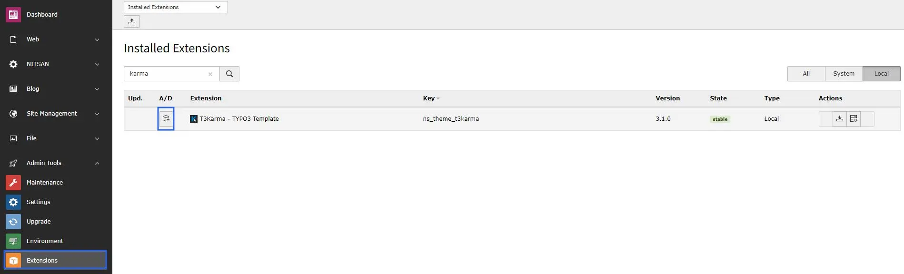

# License De-Activation

## Why De-Activate License Key?

We have the flexibility to use your license key to your any TYPO3 site/domain. Whenever you want to switch from one domain/site to another, you can use the "De-activate License" feature. To change your domain for your purchased product, you don't need to contact us - Just de-activate the license and use re-use at your new domain.

## How to De-Activate License Key?

<iframe src="https://app.supademo.com/embed/cmn4aw73y0ooaz3qm7owt0691?embed_v=2&utm_source=embed" loading="lazy" title="License De-Activation Demo" allow="clipboard-write" frameBorder="0" webkitallowfullscreen="true" mozallowfullscreen="true" allowfullscreen></iframe>

To de-activate or de-register your purchased license key from your TYPO3 instance, You can follow these steps.

<Steps>
  <Step title="Step 1">
Login to your TYPO3 Instance
  </Step>
  <Step title="Step 2">
Switch to Admin Tools > T3Planet License.
  </Step>
  <Step title="Step 3">
Click on "Deactivate License" of your particular purchased TYPO3 product.
  </Step>
  <Step title="Step 4">
Go to Admin Tools > Extensions > De-Activate Your Installed Extension.
  </Step>
</Steps>

<Warning>

Now, you can use this license key to your another TYPO3 instance because it's been de-activated from your TYPO3 instance.

</Warning>

