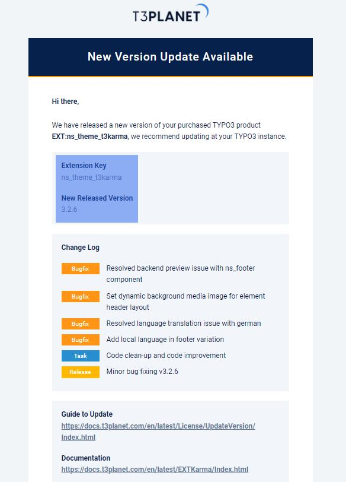
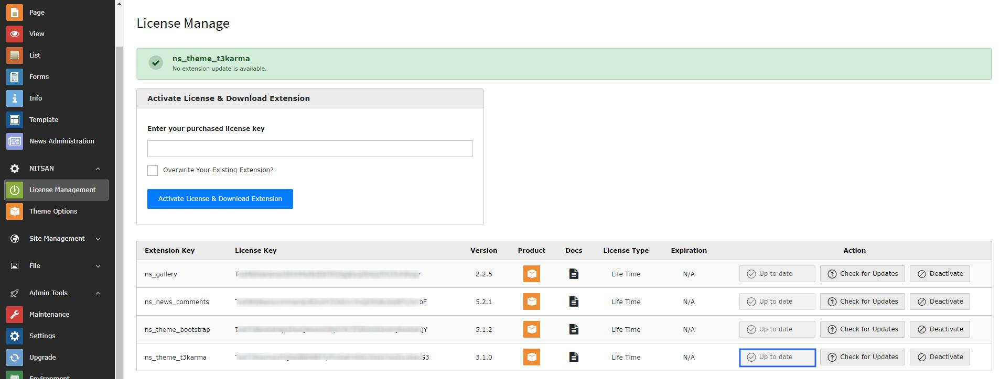
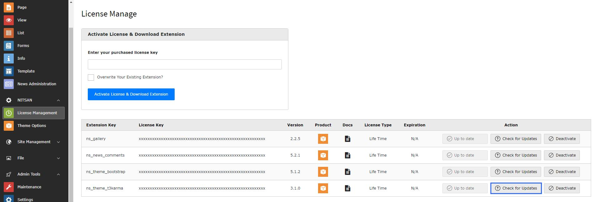

# How to know the Latest Version?

Whenever a new version is released by T3Planet for your TYPO3 product, you can directly check it in the License BE module.

Click on “Get Updates” first. If a new version is available, you will then see an “Update to x.x.x” button to install the latest version

Otherwise, you can check whether a new update is available for your purchased TYPO3 product using the steps below.

## Demo

<iframe src="https://app.supademo.com/embed/cmn5xv5kn4c3lz3qmrr926g9m?embed_v=2&utm_source=embed" loading="lazy" title="Check New Version Demo" allow="clipboard-write" frameBorder="0" webkitallowfullscreen="true" mozallowfullscreen="true" allowfullscreen ></iframe>

## Screenshots

<Steps>
  <Step title="Step 1">
Go to Admin Tools > T3Planet License.
  </Step>
  <Step title="Step 2">
Find your purchased product in the list and check whether the `New Version Available` message is shown.
  </Step>
  <Step title="Step 3">
Click on `Get Updates` button.

If a newer version is available, the `Update to x.x.x` button will become enabled.
  </Step>
  <Step title="Step 4">
Click `Update to x.x.x` (when enabled) and wait for the update process to finish.
  </Step>
</Steps>

<Warning>

1. Before updating your TYPO3 product, make sure EXT:ns_license is up to date: https://extensions.typo3.org/extension/ns_license
2. We highly recommend taking a backup (code & database) of your whole TYPO3 instance. During the update, if any problem occurs you can roll back your TYPO3 instance. Please take a backup now before update :)

</Warning>

After the update completes, you may need to run additional system update and cache flush steps (depending on your TYPO3 setup) in the guides below.

## Update for Non-Composer TYPO3 Instance

Go here [License Update Version guide](/License/UpdateVersion/NonComposer/Index)

## Update for Composer-based TYPO3 Instance

Go here [License Update Version guide](/License/UpdateVersion/Composer/Index)
