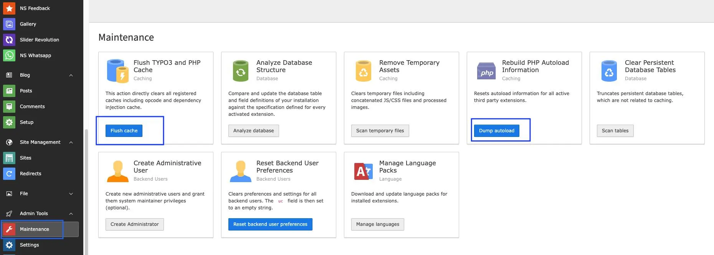

# Non-Composer Update Guide

## Minor Version Update

What's minor version update? It means, if you want to update product with security update or minor bug fixing; Example 1.1.0 to 1.2.0

### Step 1. Update New Version

- Go to NITSAN > T3Planet License
- Click on "Check for Updates" button
- If new version available then click on "Update to X.X.X" button of your particular product.

### Step 2. System Update & Flush Cache

- Go to Admin Tools > Maintenance > Anaylze Database (if any)
- Go to Admin Tools > Maintenance > Dump Autoload
- Go to Admin Tools > Maintenance > Flush Cache

## Major Version Updates

What's major version update? It means, if you want to update product with major branch version; Example 1.1.0 to 2.0.0

### Step 1. Temporary De-Activate Extension

Go to Admin Tools > Extensions > De-Activate the extension.

### Step 2. Update New Version

- Go to Admin Tools > T3Planet License
- Click on "Check for Updates" button
- If new version available then click on "Update to X.X.X" button of your particular product.

### Step 3. Update Dependent TYPO3 Extensions

Go to Extensions Manager and Update all third party dependent TYPO3 extensions to your purcahsed TYPO3 extension.

### Step 4. Activate Extension

Go to Admin Tools > Extensions > Activate the extension.

### Step 5. System Update & Flush Cache

- Go to Admin Tools > Maintenance > Anaylze Database (if any)
- Go to Admin Tools > Maintenance > Dump Autoload
- Go to Admin Tools > Maintenance > Flush Cache

