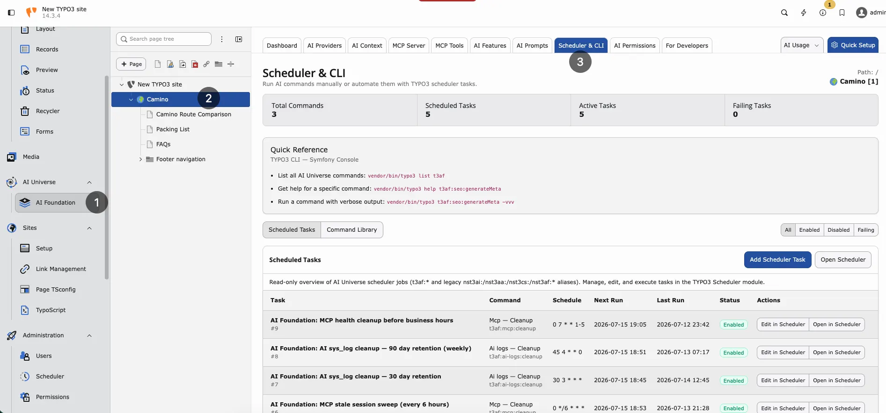

## Purpose

**Transparency** for every AI request on your TYPO3 instance. Use these screens for budget control, debugging, and compliance.

## AI Usage


<div className="t3-embed"><iframe src="https://app.supademo.com/embed/cmrbpqbgz0fn3qmo5oaq6j1t9?utm_source=link" loading="lazy" title="T3AF AI Usage Demo" allow="clipboard-write" frameBorder="0" webkitallowfullscreen="true" mozallowfullscreen="true" allowfullscreen></iframe></div>
**Path:**T3AF > AI Usage

Follow this interactive walkthrough, then continue with the details below.

Shows:

- **Request count** — Total AI calls in the selected period
- **Tokens** — Input and output volume
- **By extension** — Which extension called AI (AI Assistant, AI Chatbot, and others)
- **By feature** — For example `seo.meta_description`
- **Time range** — Day, week, or month

**Use for:** budget control, team planning, anomaly detection.

Compare usage trends on the [Dashboard](/T3AF/Configuration/Dashboard/Index).

## AI Logs


<div className="t3-embed"><iframe src="https://app.supademo.com/embed/cmrbpsdl20frlqmo521y5if8m?utm_source=link" loading="lazy" title="T3AF AI Logs Demo" allow="clipboard-write" frameBorder="0" webkitallowfullscreen="true" mozallowfullscreen="true" allowfullscreen></iframe></div>
**Path:**T3AF > AI Logs

Follow this interactive walkthrough, then continue with the details below.

Per-request detail includes:

- Timestamp, user, extension, feature
- Provider, model, tokens
- Success or failure

**Use for:** debugging failed requests and compliance audits.

## Scheduler & CLI


<div className="t3-embed"><iframe src="https://app.supademo.com/embed/cmrbpsi9d0frwqmo59f50ny8s?utm_source=link" loading="lazy" title="T3AF Scheduler and CLI Demo" allow="clipboard-write" frameBorder="0" webkitallowfullscreen="true" mozallowfullscreen="true" allowfullscreen></iframe></div>
**Path:**T3AF > Scheduler & CLI

Follow this interactive walkthrough, then continue with the details below.



Scheduler & CLI — background tasks and TYPO3 console commands for T3AF.

Background jobs and CLI commands. Example:

Flush T3AF caches
```
vendor/bin/typo3 ns_t3af:cache:flush
```

Ensure **scheduler cron** runs every minute on production.

## OpenAI org statistics (optional)

Set `openai_admin_api_key` in Extension Configuration for organization-level usage charts. This is **not** the chat API key. See [Configuration](/T3AF/Configuration/Index).

## Privacy

Log detail depends on provider privacy settings and group audit limits from [AI Permissions](/T3AF/Configuration/AIPermissions/Index). Configure carefully before enabling full prompt/response storage.

## Weekly admin habit

1. Open T3AF > AI Usage and compare the trend with last week
2. Scan T3AF > AI Logs for repeated failures (same user, same feature)
3. Escalate persistent errors to [Support](/T3AF/Support/Index) with log details

## When logs show high usage

- Check [AI Features](/T3AF/Configuration/AIFeatures/Index) — bulk tasks may need a cheaper model
- Review group limits in [AI Permissions](/T3AF/Configuration/AIPermissions/Index)
- Ask editors if a script or loop triggered many requests

## When logs show failures

- Run Test connection in [AI Providers](/T3AF/Configuration/AIProviders/Index)
- Check vendor status and rate limits
- See [Known Problems](/T3AF/Troubleshooting/KnownProblems/Index) and [FAQ](/T3AF/Troubleshooting/FAQ/Index)
