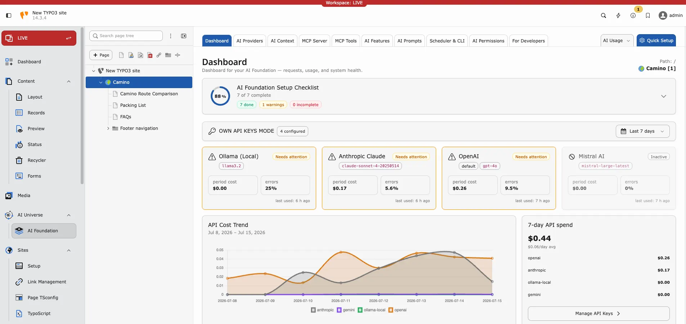
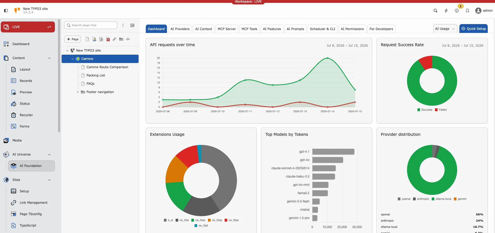
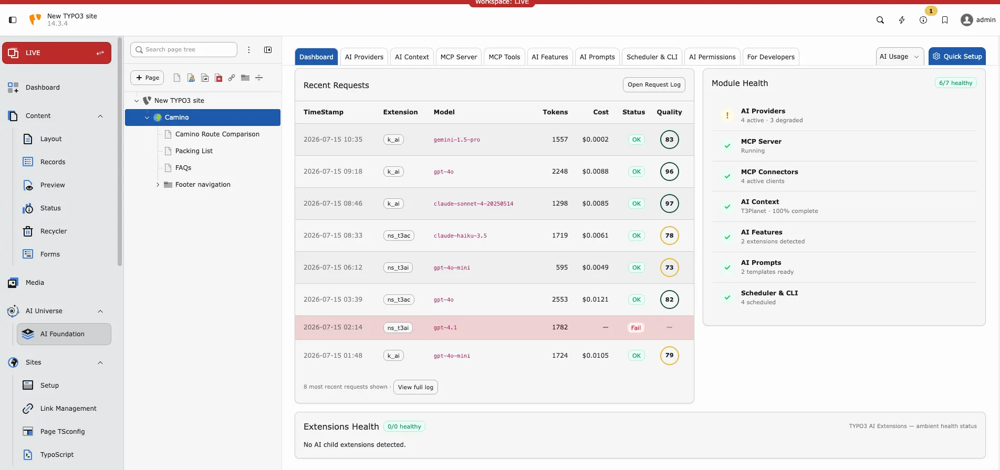

## Purpose

<iframe src="https://app.supademo.com/embed/cmrbp02gg0dysqmo5wfd0olu1?utm_source=link" loading="lazy" title="T3AF Dashboard Demo" allow="clipboard-write" frameBorder="0" webkitallowfullscreen="true" mozallowfullscreen="true" allowfullscreen></iframe>

The Dashboard is your **control center** for AI health on this TYPO3 instance. Open it daily for a quick status check.

**Path:**T3AF > Dashboard

Follow this interactive walkthrough, then continue with the details below.

Dashboard overview — setup progress, provider health, and API cost trend.

Usage analytics — requests over time, success rate, top models, and provider distribution.

Recent requests and module health — request log, costs, and subsystem status.

## What the dashboard shows

- **Provider status** — Connected, failed, or not tested
- **Default provider** — Active model name
- **Recent usage** — Last requests and token count
- **Quick actions** — Links to AI Providers, MCP Server, and related modules

## Daily admin routine (2 minutes)

1. Open Dashboard
2. Confirm provider status is **green**
3. Skim **AI Logs** if usage looks unusual — see [AI Usage & Logs](/T3AF/Configuration/AIUsageAndLogs/Index)

## Status meanings

- **Green** — Provider OK. No action needed.
- **Yellow** — Not tested recently. Run a Test connection in [AI Providers](/T3AF/Configuration/AIProviders/Index).
- **Red** — Connection failed. Check API key, model ID, and outbound HTTPS.

## Quick links from the dashboard

- **AI Providers** → [AI Providers](/T3AF/Configuration/AIProviders/Index)
- **MCP Server** → [MCP Server](/T3AF/Integrations/MCPServer/Index)
- **View Logs** → [AI Usage & Logs](/T3AF/Configuration/AIUsageAndLogs/Index)

## Tips

- Set one clear **default provider** — avoids confusion for editors
- Test providers after every key rotation
- Review usage weekly for cost control

## When the dashboard shows red

1. Open [AI Providers](/T3AF/Configuration/AIProviders/Index) → run **Test connection**
2. Check vendor status page (OpenAI, Anthropic, etc.)
3. Verify firewall allows outbound HTTPS
4. Check [AI Logs](/T3AF/Configuration/AIUsageAndLogs/Index) for the exact error message
5. See [Known Problems](/T3AF/Troubleshooting/KnownProblems/Index) if the issue persists
