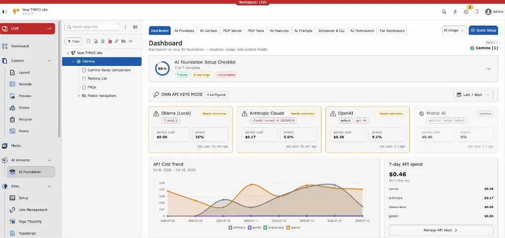

## EXT:ns_t3af

## Overview

**T3AF** (`EXT:ns_t3af`) is T3Planet’s shared AI foundation for TYPO3. It is the central engine behind all T3Planet AI extensions.

T3AF connects TYPO3 to AI models, manages API keys, exposes an MCP server for AI agents, and logs every request — so your team uses AI in a safe, consistent way. Editors work through connected extensions such as AI Assistant or AI Chatbot. Admins configure everything in the **T3AF** backend module group.

### Key capabilities

- **AI Providers** — Connect OpenAI, Claude, Gemini, and other vendors with encrypted API keys
- **MCP Server** — Expose TYPO3 to Cursor, Claude Desktop, and other MCP clients
- **AI Context** — Store brand voice once for on-brand AI output
- **AI Prompts & Features** — Shared prompt templates and per-feature provider assignment
- **Usage & Logs** — Token usage, request history, and operational telemetry
- **AI Permissions** — Role-based access for backend usergroups, modules, features, records, and credit limits
- **Quick Setup** — Guided first-time configuration wizard

### Helpful Links

<Note>
- Product: [https://t3planet.de/ai-foundation-fur-typo3](https://t3planet.de/ai-foundation-fur-typo3)
- Get support: [https://t3planet.de/support](https://t3planet.de/support)
- License activation: [https://docs.t3planet.de/en/latest/License/Index.html](/License/Index)
</Note>

## Video Tutorials

Use these interactive walkthroughs to learn **T3AF** setup and daily operation. Watch a demo, then return to the matching documentation page for full details.

Follow the recommended order below and practice on a staging TYPO3 instance.

### Dashboard overview

<iframe src="https://app.supademo.com/embed/cmrbp02gg0dysqmo5wfd0olu1?utm_source=link" loading="lazy" title="T3AF Dashboard Demo" allow="clipboard-write" frameBorder="0" webkitallowfullscreen="true" mozallowfullscreen="true" allowfullscreen></iframe>

Start here for a high-level tour of the T3AF Dashboard.

Next: [Dashboard](/T3AF/Configuration/Dashboard/Index)

### Install and Quick Setup

<iframe src="https://app.supademo.com/embed/cmrbnnxgy0cp3qmo5e1ciofeq?utm_source=link" loading="lazy" title="T3AF Quick Setup Demo" allow="clipboard-write" frameBorder="0" webkitallowfullscreen="true" mozallowfullscreen="true" allowfullscreen></iframe>

Learn how to activate T3AF and complete first-time setup.

Next: [Installation](/T3AF/Installation/Index)

### Configure AI providers

<iframe src="https://app.supademo.com/embed/cmrbo0w7i0d96qmo57ifnabvz?utm_source=link" loading="lazy" title="T3AF Providers Demo" allow="clipboard-write" frameBorder="0" webkitallowfullscreen="true" mozallowfullscreen="true" allowfullscreen></iframe>

Connect vendors, save credentials, and verify provider health.

Next: [AI Providers](/T3AF/Configuration/AIProviders/Index)

### MCP Server

<iframe src="https://app.supademo.com/embed/cmrbp5q660ej4qmo546ztyk1h?utm_source=link" loading="lazy" title="T3AF MCP Server Demo" allow="clipboard-write" frameBorder="0" webkitallowfullscreen="true" mozallowfullscreen="true" allowfullscreen></iframe>

Connect Cursor and other MCP clients to your TYPO3 instance.

Next: [MCP Server](/T3AF/Integrations/MCPServer/Index)

### AI Permissions

<iframe src="https://app.supademo.com/embed/cmrbpvc5y0g0vqmo5l30iq6mc?utm_source=link" loading="lazy" title="T3AF AI Permissions Demo" allow="clipboard-write" frameBorder="0" webkitallowfullscreen="true" mozallowfullscreen="true" allowfullscreen></iframe>

Control usergroup access, modules, features, and credit limits.

Next: [AI Permissions](/T3AF/Configuration/AIPermissions/Index)

### Usage and cost control

<iframe src="https://app.supademo.com/embed/cmrbpqbgz0fn3qmo5oaq6j1t9?utm_source=link" loading="lazy" title="T3AF AI Usage Demo" allow="clipboard-write" frameBorder="0" webkitallowfullscreen="true" mozallowfullscreen="true" allowfullscreen></iframe>

Review tokens, spend trends, and request history.

Next: [AI Usage & Logs](/T3AF/Configuration/AIUsageAndLogs/Index)

## Credits

This extension is developed and maintained by:

**T3Planet project by NITSAN**: [https://nitsantech.de/typo3-agentur](https://nitsantech.de/typo3-agentur)

Developed with modern AI tooling by the NITSAN/T3Planet team — following TYPO3 coding standards, reviewed by certified TYPO3 developers, and tested across TYPO3 v12, v13 and v14.
