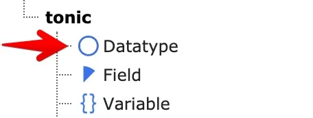
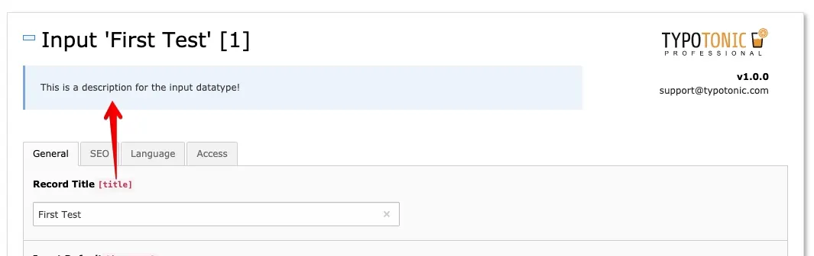

A Datatype describes one record type (for example News or Event). It defines which fields the record uses and how it appears in the backend.

Open the **List** module, click **Create new record**, and select **Datatype** under the **tonictypes** section.
Create your fields first, or assign them later.

*Creating a new Datatype record*

## Tab: General

*General tab of a Datatype*

- **Name** — Datatype name (Movie, News, Job, Address, …).
- **Description** — Shown when editors create or edit records of this type.
- **Tablename** — Database table name (generated). Use **Update Table** to run the Schema Migrator when needed.
- **According PHP Class** — Domain Model and Repository. Use **Generate Class** / **Update Class** to create or refresh them.

## Tab: Fields

Assign fields to this Datatype. Assignment order is the order in the record edit form.

## Tab: Tab Configuration

- **Disable 'General' Tab** — Hides the default General tab (unassigned fields are hidden too).
- **Create tabs and assign fields** — Custom tabs and palettes.

## Tab: Appearance

- **Icon** — Backend icon (and page-tree icon when page behaviour uses this Datatype).
- **Color** — Background while creating or editing a record.
- **Hide Records of this type in list** — Useful for inline-only datatypes.
- **Hide Button to Add new Record** — Hides the add button for this type on the selected page.
- **Default hidden** — When enabled, new records of this Datatype start as **hidden/disabled** (`default_hidden`). Available in Core from 2.1.0.

## Sharing datatypes between instances

- **System > Export / Import** — Export or import datatype structures (fields, variables, table schema). This transfer module lives in **Core** from 2.1.0 (not Professional-only).
- **Dashboard widget** — **Predefined Datatype Import** loads the bundled sample datatype.

Professional-only field types in an import need `k3n/tonictypes_pro` installed on the target instance.

## Next Step

Continue with [Creating a Template Variable](/en/latest/TonicTypes/GettingStarted/CreatingATemplateVariable/Index), or [Templating](/en/latest/TonicTypes/GettingStarted/Templating/Index).
