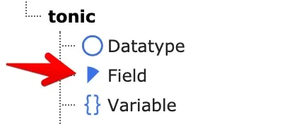
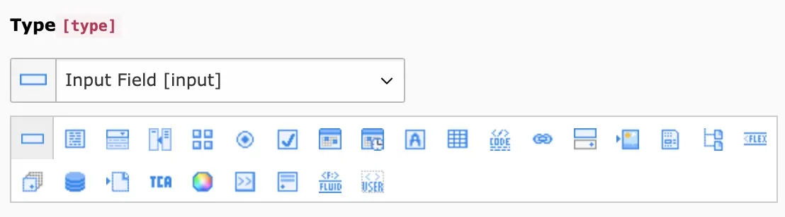
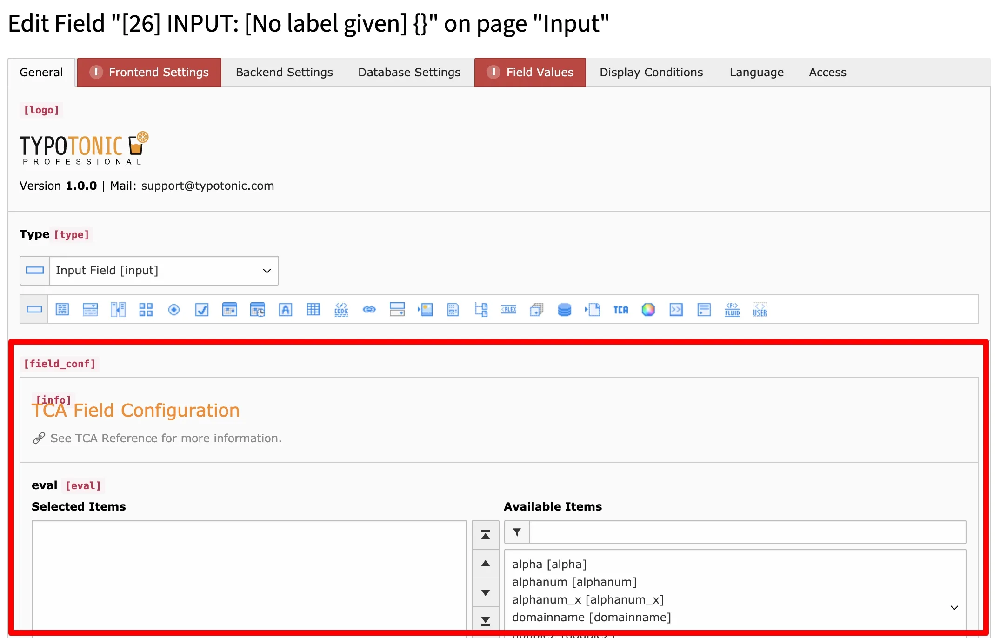

Fields are the building blocks of a Datatype. Create the fields you need before you build the Datatype, or add them later.

Open the **List** module, click **Create new record**, and select **Field** under the **tonictypes** section.

*Creating a new Field record*

## Tab: General

- **Type** — Field type (for example input, textarea, select). This controls which options appear next.
- **Field Configuration** — Type-specific options.

Core ships standard field types. Advanced types (DynamicInput, Inline, Flex, PassThrough, Datatype, TCA, Fluid, Content, UserFunc) require [TonicTypes Professional](/en/latest/TonicTypes/Professional/Index).

*General field configuration*

## Tab: Frontend Settings

- **Frontend Label** — Label shown for the field. TonicTypes also derives a variable name from it.
- **Custom Variable Name** — Override the generated name. Available in templates as `{record.yourvariable}`.
- **Frontend Type Definition** — Extbase/PHP type used when mapping the stored value for the frontend and domain model.
- **Is Object Storage** — Enable when the field stores multiple values (for example inline). Values are wrapped in an ObjectStorage.

## Tab: Backend Settings

- **Use as record title** — Use this field as the backend record title. Combine several title fields with a **Title Divider Character** on the Datatype **Appearance** tab.
- **Use value as path segment** — Use this field for the record URL path segment.
- **Searchable in Backend** — Include in backend search.
- **Exclude for non-admin users** — Hide unless admin or allowed via exclude fields.
- **Exclude from translations** — Hide on translated records.
- **Palette** — Group fields on one row in the edit form.
- **Backend Description** — Help text next to the field.

## Tab: Database Settings

- **Database Type Definition** — Column type. Default **Inherit from Tca/Field Class** is usually correct.
- **Is Index Field** — Add a DB index on the next Schema Migrator run.

## Tab: Field Values

Define selectable values (for example select options):

- **Static Value** — Fixed text (Fluid allowed).
- **Database Value** — Value from a configured query.
- **TypoScript** — Value from TypoScript.
- **Values of all records** — Existing values already used for this field.

Mark a value as **Is Default** or **Pretends to be an empty value** when needed.

## Tab: Display Conditions

- **Request update** — Reload the form when this field changes.
- **Display Conditions** — For example `FIELD:2:IN:Selection 1,Selection2`, or FlexForm condition syntax.

## Next Step

Continue with [Creating a Datatype](/en/latest/TonicTypes/GettingStarted/CreatingADatatype/Index).
