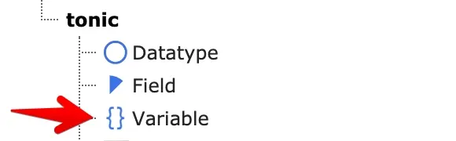
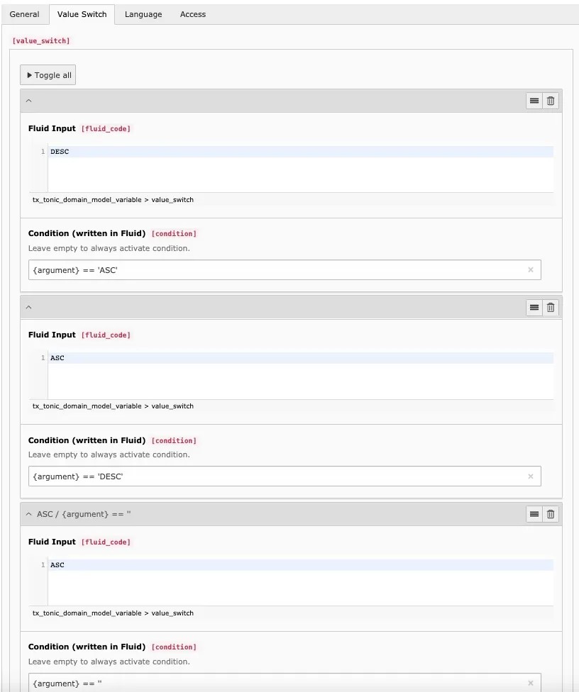

Template Variables inject dynamic values into TonicTypes Fluid templates. Select them in List / Detail / Dynamic / Plain plugins.
Use them for filters, search, sorting, or conditional template behaviour.

## Configuration

- **Name** — Variable name used in Fluid.
- **Type** — Where the value comes from.

## Available Types

- **Fixed Value** — Fixed text.
- **TypoScript Value** — Parsed from TypoScript.
- **GET Variable** / **POST Variable** — From the request.
- **Database Value** — From a configured query.
- **Frontend User** — Logged-in frontend user.
- **Server Variable** — From PHP `$_SERVER`.
- **User Session Variable** — Frontend user session.
- **Page** — Selected page information.
- **UserFunc** — Output of a PHP user function.
- **Backend User** — Logged-in backend user, or `null`.
- **Language Id** — Current language ID.
- **TonicTypes Session Service Container** — Active filters, searches, and related session data.

## Typical Use Cases

- Inject dynamic values (for example the current date).
- Inject list/back page IDs instead of hardcoding.
- Add custom PHP values via TypoScript / UserFunc.
- Inject the current record when several plugins share a page.
- Drive plugin filters and sorting with GET parameters.

## GET and POST Variables

- **Type Definition** — Restrict data type.
- **Regular Expression** — Further restrict values.
- **Allowed Values** — Whitelist.
- **Value Switch** — Change the value with Fluid based on a condition (first match wins).

*Example: Value Switch reversing a sort-order parameter*

## Next Step

Continue with [Templating](/en/latest/TonicTypes/GettingStarted/Templating/Index).
