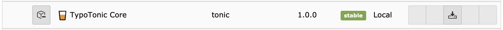
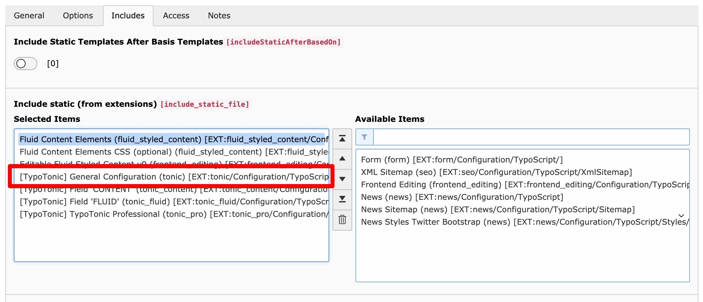
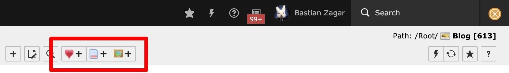
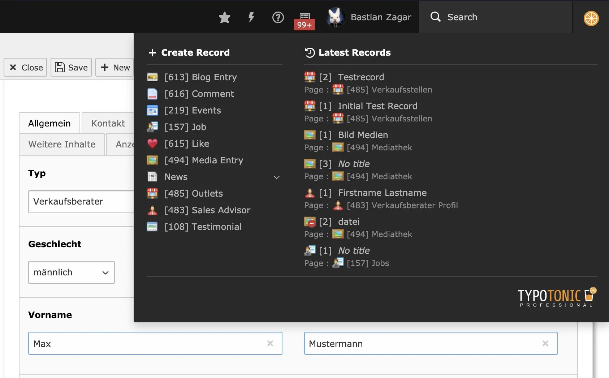

This documentation set focuses on **TonicTypes Professional** (`k3n/tonictypes_pro`). Core (`k3n/tonictypes`) is required and is covered here for install order and shared setup.
## Compatibility

- **TYPO3:** 12.4 – 14.9
- **PHP:** 8.2 – 8.5
- **Free Core:** Composer `k3n/tonictypes`, extension key `tonictypes`
- **Professional:** Composer `k3n/tonictypes_pro`, extension key `tonictypes_pro` (requires Core 2.x, `nitsan/ns-license`, and `nitsan/ns-t3af`)

Free TonicTypes Extension: [https://extensions.typo3.org/extension/tonictypes](https://extensions.typo3.org/extension/tonictypes)

## Step 1 — Install Core

### Composer (recommended)

```bash
composer require k3n/tonictypes
```

### Extension Manager / ZIP

Install from the [TER page for tonictypes](https://extensions.typo3.org/extension/tonictypes) if you do not use Composer.



*Extension Manager after installation*

## Step 2 — Activate configuration

Use **either** Site Sets (recommended on TYPO3 v13+) **or** classic TypoScript static templates. You can combine them if you disable **Clear constants** / **Clear setup** on the root `sys_template` so Site Set TypoScript is not wiped.

### Site Sets (recommended for TYPO3 v13+)

In `config/sites/<identifier>/config.yaml` or via **Sites > Setup**:

```yaml
dependencies:
  - k3n/tonictypes
```

With Professional installed:

```yaml
dependencies:
  - k3n/tonictypes
  - k3n/tonictypes_pro
```

Plugin options (cache lifetime, Fluid paths, variable names) are available under **Sites > Settings** and stay aligned with `plugin.tx_tonictypes.*` constants.

List sets:

```bash
vendor/bin/typo3 site:sets:list
```

### TypoScript static template (classic)

1. Open the **Template** module on the site root.
1. **Info/Modify** → **Edit the whole template record** → **Includes**.
1. Include **[Tonictypes] General Configuration**.
1. For Professional, also include **[Tonictypes] Tonictypes Professional**.



*Static template includes*

## Step 3 — Clear caches

Clear all TYPO3 caches after install or upgrade. After upgrading Core, also run **Analyze Database Structure**.

## Install Professional (optional)

Professional depends on Core. After Core is working:

```bash
composer require k3n/tonictypes_pro
```

Ensure `nitsan/ns-license` and `nitsan/ns-t3af` are available (declared dependencies of `k3n/tonictypes_pro`). Activate the Professional Site Set or static template as above, then clear caches.

Details: [TonicTypes Professional](/en/latest/TonicTypes/Professional/Index).

## Additional configuration

### Predefine templates in TypoScript

```typoscript
plugin.tx_tonictypes.templates {
    myTemplateIdentifier {
      group = General
      icon = EXT:tonictypes/Resources/Public/Icons/Datatype/animal-dog.png
      name = My Test Template
      file = EXT:yourtemplateext/Resources/Private/Templates/Tonictypes/TemplateOne.html
    }
}
```


*Predefined template in the selector*

Render with `dv:template.render`. See [ViewHelpers](/en/latest/TonicTypes/ViewHelpers/Index).

### DocHeader “Add record” buttons (Professional)

With Professional installed, show create buttons for selected datatypes in the list module DocHeader. Set Page TSconfig:

```typoscript
tx_tonictypes.docHeaderDatatypes = 1,2,3
```



*DocHeader buttons for selected Datatype UIDs*

You can also enable this by selecting a datatype behaviour on the page. See [TonicTypes Professional](/en/latest/TonicTypes/Professional/Index).

### Toolbar item (Professional)

Professional registers a backend toolbar item for recent records and quick create.



*Professional toolbar item*

Disable per user / group with User TSconfig:

```typoscript
options.tonictypes.disableTonictypesToolbarItem = 1
```

### Frontend record edit button (Core)

When a backend **admin** is logged in and previewing a detail view, Core can show a frontend edit button. Enable with User TSconfig:

```typoscript
options.tonictypes.enableRecordEditButton = 1
```


*Edit button (admin backend session only — not for anonymous frontend users)*

### Branding overrides (typically with Professional)

```typoscript
options.tonictypes.customSupportEmail = support@example.com
options.tonictypes.customLogo = EXT:tonictypes/Resources/Public/Images/logo_tonictypes_pro.svg
options.tonictypes.customLogoBright = EXT:tonictypes/Resources/Public/Images/logo_tonictypes_pro_bright.svg
options.tonictypes.disableSupportMessage = 1
options.tonictypes.disableTonictypesLogo = 1
```

## Upgrade notes (2.1.0+)

- PHP 8.2 or higher
- Use Professional with Core 2.1.0+ (datatype transfer module lives in Core)
- Professional-only field types require `k3n/tonictypes_pro`
- After upgrade: **Analyze Database Structure**, then clear all caches

## Next steps

Continue with [Getting Started](/en/latest/TonicTypes/GettingStarted/Index).
